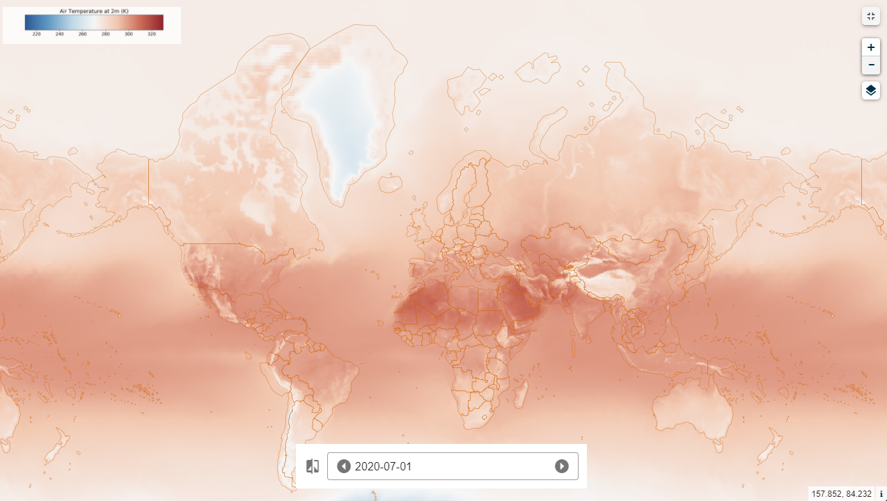

# 2mT_2020_Monthly_Average_from_CDS

## Short description
Temperature of air at 2m above the surface of land, sea or in-land waters. 2m temperature is calculated by interpolating between the lowest model level and the Earth's surface, taking account of the atmospheric conditions. Temperature measured in kelvin can be converted to degrees Celsius (°C) by subtracting 273.15.
## Band information
the product contains one single band named "AIR2MT" expressed in K

## More information
- [Data Source](https://cds.climate.copernicus.eu/cdsapp#!/dataset/reanalysis-era5-land-monthly-means?tab=overview)
- [Data Documentation](https://confluence.ecmwf.int/display/CKB/ERA5-Land%3A+data+documentation)
- [Climate Data for Covid-19 research](https://climate.copernicus.eu/climate-information-support-covid-19-research)
- [Zaitchik, B.F., Sweijd, N., Shumake-Guillemot, J. et al. A framework for research linking weather, climate and COVID-19. Nat Commun 11, 5730 (2020)](https://doi.org/10.1038/s41467-020-19546-7)

*Global coverage of Air Temperature at 2 m*