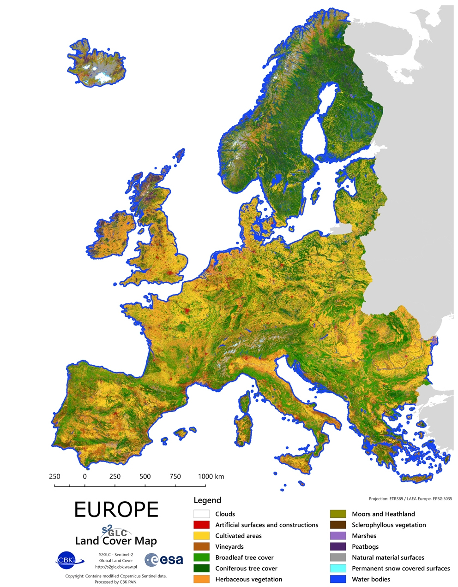

# CAMS_GLC_2017

## Short description
High resolution Land Cover Map of Europe
The S2GLC 2017 product represents land cover classification of a major portion of the European continent. The classification has been performed using multi-temporal Sentinel-2 data collected during the year 2017 with the methodology developed in the frame of the Sentinel-2 Global Land Cover (S2GLC) project. The S2GLC 2017 dataset is delivered with 10 m spatial resolution with thematic legend composed of 13 land cover classes. More detailes about S2GLC 2017 product may be found at LINK.

Access to data is available as WMS via CREODIAS Browser or for download via CREODIAS Finder (collection: S2GLC).

The Sentinel-2 Global Land Cover (S2GLC) project was founded by the European Space Agency (ESA) through its Scientific Exploitation of Operational Missions (SEOM) element. The project was implemented by a consortium led by CBK PAN. The main goal of the project was to develop a methodology for producing a new high resolution global land cover map based on Sentinel-2 imagery.
## Band information
the product is single file with mosaic of Europe in one RGB GeoTiff file, and contains three bands "RED,GREEN,BLUE".

## More information
- [Data Source](http://s2glc.cbk.waw.pl/extension)
- [Data Documentation](http://s2glc.cbk.waw.pl/)
- [Project home page](http://s2glc.cbk.waw.pl/)

*European coverage of global Land Cover at 10m resolution*