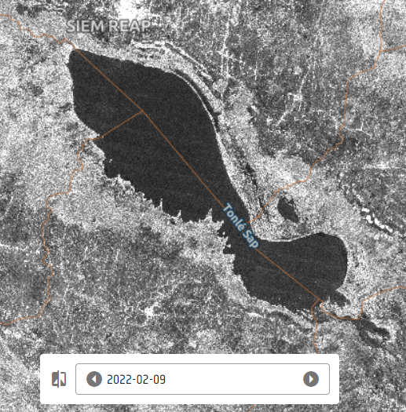

# Jaxa_lakes_ALOS2_HH

## Short description

This ALOS-2 product contains SAR data (polarization HH) over the Tonlé Sap Lake. The selected AOI presents data between 2016 and 2022.

## More information

- [Data Source](https://www.emodnet-humanactivities.eu/view-data.php)
- [Data Documentation](https://www.emodnet-humanactivities.eu/documents/Vessel%20density%20maps_method_v1.5.pdf)
- [Data and Metadata information](https://www.emodnet-humanactivities.eu/search-results.php?dataname=Vessel+Density+)

### ALOS-2 Tonlé Sap Lake AOI

 
*Tonlé Sap Lake*
