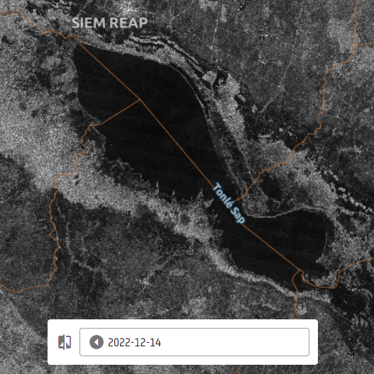

# Jaxa_lakes_ALOS2_HV

## Short description

This ALOS-2 product contains SAR data (polarization HV) over the Tonlé Sap Lake. The selected AOI presents data between 2016 and 2022.

## License  

ALOS-2 ScanSAR data products usage conditions:
 1. JAXA does not guarantee any specific quality and the timely provision of the ALOS-2 ScanSAR data products and shall 
not be liable for any damage brought about using them.
 2. The intellectual property rights, including but not limited to copyrights, of the ALOS-2 ScanSAR data Products 
belong to JAXA.
 3. The user shall retain the ownership of value-added products (modified products with high-level processing which are irreversible to standard data. High-level data processing includes data analysis or combining multiple-ALOS-2 ScanSAR data Product, image processing based on external information, and physical quantity conversion).
 4. When the user publishes and/or redistributes their-generated value-added products based on the ALOS-2 ScanSAR data Product, user will indicate: "the original ALOS-2 ScanSAR data products are provided by JAXA".
 5. When the user intends to publish the results directly using or indirectly based on the ALOS-2 ScanSAR data products, the user will indicate owner of the Data Products as "(C)JAXA [year of acquisition]. All rights reserved."

### ALOS-2 Tonlé Sap Lake AOI

 
*Tonlé Sap Lake*
