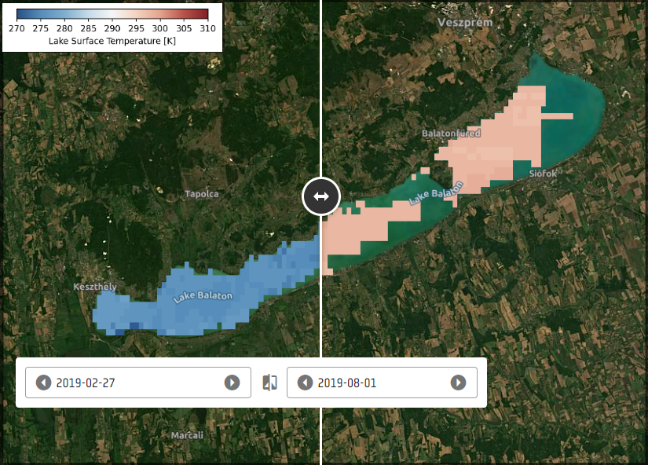

# Lakes_surface_water_temperature

## Short description

Lakes and enclosed inland seas are integrators of environmental and climatic changes occurring within their contributing basins. 
Factors driving lake conditions vary widely across space and time, and lakes, in turn, play an essential role in local and global climate regulation, with positive and negative feedback depending on the catchment. 
Understanding the complex behaviour of lakes in a changing environment is essential to effective water resource management and mitigation of climate change effects. 

Lakes have been observed as sentinels of climate change, both directly and indirectly, through watershed changes. 
Lakes integrate responses over time, and studies of globally distributed lakes can capture different aspects of climate change. 
Therefore, a global and consistent climate data record of lakes is essential to mitigate and adapt to climate change.

This particular layer refers to Balaton Lake Surface Water temperature (LSWT), correlated with regional air temperatures and a proxy for mixing regimes, driving biogeochemical cycling and seasonality.

## More information

- [Data Source](https://catalogue.ceda.ac.uk/uuid/a07deacaffb8453e93d57ee214676304)
- [Data Documentation](https://climate.esa.int/en/projects/lakes/key-documents-lakes/)

### Balaton Lake surface water temperature

 
*Balaton Lake surface water temperature*
