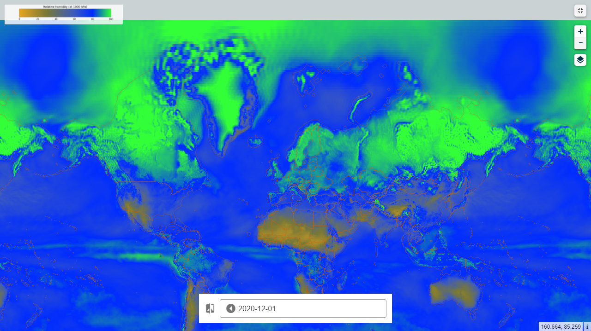

# RelativeHum1000hPa

## Short description

This parameter is the water vapour pressure as a percentage of the value at which the air becomes saturated (the point at which water vapour begins to condense into liquid water or deposition into ice). For temperatures over 0°C (273.15 K) it is calculated for saturation over water. At temperatures below -23°C it is calculated for saturation over ice. Between -23°C and 0°C this parameter is calculated by interpolating between the ice and water values using a quadratic function.

## Band information

The product contains one single band named "RelH" expressed in m % at 1000hPa

## More information

- [Data Source](https://cds.climate.copernicus.eu/cdsapp#!/dataset/reanalysis-era5-pressure-levels-monthly-means?tab=overview)
- [Data Documentation](https://confluence.ecmwf.int/display/CKB/ERA5%3A+data+documentation)
- [Climate Data for Covid-19 research](https://climate.copernicus.eu/climate-information-support-covid-19-research)
- [Zaitchik, B.F., Sweijd, N., Shumake-Guillemot, J. et al. A framework for research linking weather, climate and COVID-19. Nat Commun 11, 5730 (2020)](https://doi.org/10.1038/s41467-020-19546-7)

 
*Global coverage of ARelative humidity at 1000hPa level*
