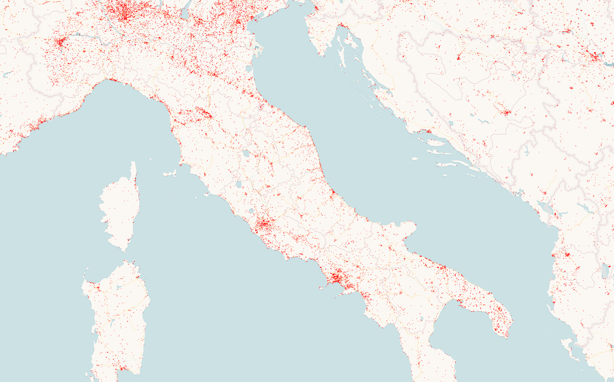

# WSF2019_World_Settlment_Footrpint_2019

## Short description

The World Settlement Footprint suite consists of several different products, two of which have been publicly released this week during the United Nations Climate Change Conference (COP26) for the Cities, Regions & Built Environment Day: The World Settlement Footprint 2019 (WSF 2019) and the World Settlement Footprint Evolution (WSF Evolution). 
These products were built using millions of hours of compute time with Google Earth Engine, Google’s platform for geospatial data analysis.

The WSF 2019, which provides information on global human settlements with unprecedented detail and precision, features data from the Copernicus Sentinel-1 and Sentinel-2 missions, while the WSF Evolution has been generated by processing seven million images from the US Landsat satellite collected between 1985 and 2015 and illustrates the worldwide growth of human settlements on a year-by-year basis.

This unprecedented collection of global products on human settlement advances our understanding of urbanisation on a global scale. 

The dataset is organized in 5138 GeoTIFF files (EPSG 4326 projection) each one referring to a portion of 2 x 2 degree size (~222 x 222 km) on the ground. 
Settlements are associated with value 255; all other pixels are associated with value 0.

## References

Mattia Marconcini, Annekatrin Metz-Marconcini, Thomas Esch and Noel Gorelick. Understanding Current Trends in Global Urbanisation - The World Settlement Footprint Suite. GI_Forum 2021, Issue 1, 33-38 (2021) https://austriaca.at/0xc1aa5576%200x003c9b4c.pdf

## More information

- [Data Source](https://download.geoservice.dlr.de/WSF2019/files/)
- [Data Documentation](https://geoservice.dlr.de/web/maps/eoc:wsf2019#)
- [Read More] (https://www.esa.int/Applications/Observing_the_Earth/Mapping_our_human_footprint_from_space)

### World Settlment Footprint Example

 
*WSF2019 View over Italy*