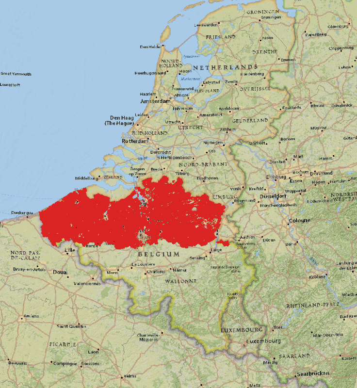

# Belgium Flanders GSAA

## Short Description  
Flemish Geo-spatial Aid Application (GSAA) data is managed by [the Belgium Department of Agriculture and Fisheries](https://lv.vlaanderen.be/nl).
It contains the parcels that are in agricultural use on the deadline for submission of the single application that year. The register also includes pounds, wood edges and agricultural production facilities (stables and similar buildings).  

The inventory of these parcels takes place annually in the context of the payment of the (co-financed) European agricultural subsidies and the Flemish manure legislation. It can be used for consultation or study of the land use of agricultural parcels for the year in question. This dataset does not contain all data from original GSAA dataset. Only the main crop and the production method are included as attribute information. It forms the basis for the aforementioned registration.  

The GSAA is prepared with screen digitization of the agricultural parcels of each farmer individually, based on the agricultural parcels of the previous year and the farmer's collective application. For the background, the most recent colour orthophotos of [the Flemish Geographical Information Agency (AGIV)](https://overheid.vlaanderen.be/informatie-vlaanderen/flanders-information-agency-en) at that time are used. 


## Coordinate Reference System
EPSG: 31370 (Belge 1972 / Belgian Lambert 72 -- Belgium) , [more info](https://epsg.io/31370)

Use the GDAL command below to convert the GSAA collection's CRS into CRS of your choice:

```
ogr2ogr [-s_srs srs_def] [-t_srs srs_def] [dstfile] [srcfile]
```
- `s_srs <srs_def>`: set source spatial reference
- `t_srs <srs_def>`: set target spatial reference
- `<dstfile>`: file with destination projection definition
- `<srcfile>`: file with source projection definition

Example of converting  from EPSG:31370 to EPSG:3857 
```
ogr2ogr -s_srs EPSG:31370 -t_srs EPSG:3857 gsaa_3857.shp gsaa_31370.shp
```

## Attribute Information  

### Table 1: Description of Attributes
<table>
  <thead>
    <tr>
      <th>Name</th>
      <th>Type </th>
      <th>Description</th>
    </tr>
  </thead>
  <tbody>
    <tr>
      <td>OIDN</td>
      <td > Long</td>
      <td>Object identifier. Serial number assigned by the AGIV based on the ALVID</td>
    </tr>
    <tr>
      <td>UIDN</td>
      <td >Long </td>
      <td> Identifier assigned by the AGIV. The combination of OIDN and UIDN is a unique identifier</td>
    </tr>
    <tr>
      <td>ALVID</td>
      <td > Long</td>
      <td>Unique identifier assigned by Department for agriculture and fisheries (LV)</td>
    </tr>
    <tr>
      <td>HFDTLT</td>
      <td >String</td>
      <td >Main crop type, i.e. parcel crop type on 21st April of the relevant year </td>
    </tr>
    <tr>
      <td>LBLHFDTLT</td>
      <td >String </td>
      <td>Crop type description </td>
    </tr>
    <tr>
      <td>GEWASGROEP</td>
      <td > String </td>
      <td> Crop group  </td>
    </tr>
      <tr>
      <td>PM</td>
      <td > String </td>
      <td> Production method code </td>
    </tr>
      <tr>
      <td>LBLPM</td>
      <td > String </td>
      <td> Production method code description</td>
    </tr>
      <tr>
      <td>LENGTE</td>
      <td > Double</td>
      <td> Perimeter calculated based on the geometry of the polygon (in m) </td>
    </tr>
      <tr>
      <td>OPPERVL</td>
      <td > Double </td>
      <td> Parcel area calculated based on the geometry of the polygon (in m²) </td>
    </tr>
  </tbody>
</table>   

### Table 2: Description of crop groups (GEWASGROEP)

| GEWASGROEP | English Description |
| ------- |  ------------ |
| Aardappelen | Potatoes |
| Fruit en Noten | Fruits and nuts |
| Granen, zaden en peulvruchten | Grains, seeds and legumes |
| Grasland | Grassland |
| Groenten, kruiden en sierplanten | Vegetables, herbs and ornamental plants |
| Houtachtige gewassen | Trees and shrubs |
| Landbouwinfrastructuur | Agricultural infrastructure |
| Maïs | Maize |
| Overige gewassen | Other crops |
| Suikerbieten | Sugar beet |
| Vlas en hennep | Flax and hemp |
| Voedergewassen | Fodder crops |
| Water | Water |

## More Information

### References  

- [Department of Agriculture and Fisheries](https://lv.vlaanderen.be/nl)  

- [Information Flanders)](https://overheid.vlaanderen.be/informatie-vlaanderen)

### Online Resources    

- [Publicly available compressed ESRI shapefiles or GML (2. 1. 2)](https://download.vlaanderen.be/Catalogus), (section “Landbouw en veeteelt”) updated annually. There are no limitations to the use of these data.  

- Download via [Geopunt catalog](http://www.geopunt.be/catalogus)  with title "Landbouwgebruikspercelen"  

- [Geopunt Map](http://www.geopunt.be/), central gateway to geographic government information. Under Thema’s > Landbouw, visserij en economie > Landbouw.  

### Geographic Location  

  
Source: ESRI National Geographic

