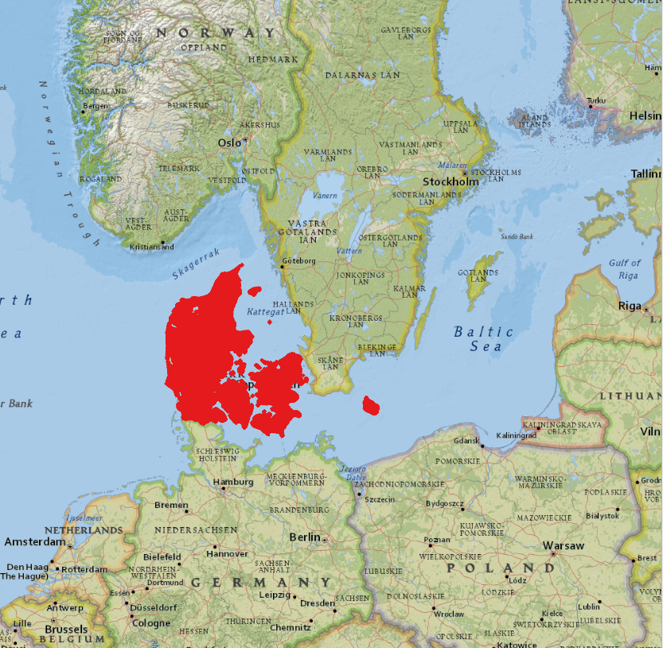

# Denmark LPIS

## Short Description  

Danish Land Parcel Identification System (LPIS) data is managed by [the Danish Agency for Agriculture](https://lbst.dk/om-os/) an agency under [the Ministry of Environment and Food](https://mfvm.dk/). The data is made available for download on the agency’s website.  Additionally, the metadata are made available and can be searched on [Geodata-info.dk](https://www.geodata-info.dk/srv/eng/catalog.search#/home) geoportal, which is managed by the Danish Agency for Data Supply and Efficiency.  

LPIS data is comprised of field block map which is a digital map with agricultural areas collected in field blocks covering the whole country. A block of land is a geographically coherent unit consisting of agricultural land which one or more farmers cultivate one or more different crops. The boundaries of the field blocks typically follow permanent boundaries in the landscape.  

The field block map only contains polygons created by the Danish Agency for Agriculture in connection with the management of the EU's common agricultural policy. The polygons for field blocks are manually created based on available orthophotos. The polygons are updated at least every three years.    

In some cases, the polygons are updated more frequently if inquiries are received from the farmer or the systematic field visits require it. Updating the field block theme can also be triggered by the changes in the eligibility conditions. It is updated either automatically after prior screening or manually by an internal operator. Other related services are updated daily and reflect the current situation.  

The field blocks data are used in the administration of cases related to the geographical location of arable land, primarily by EU area-based support schemes. The field block map contains approx. 450,000 field blocks, which cover approx. 2.8 million hectares of agricultural land. Each field block is identified by a field block number and contains attributes for geographical area, eligible and ineligible area and the orthophoto used during digitizing of the blocks. 

## Coordinate Reference System
EPSG:25832 (ETRS89 / UTM zone 32N) , [more info](https://epsg.io/25832)  

Use the GDAL command below to convert the LPIS collection's CRS into CRS of your choice:

```
ogr2ogr [-s_srs srs_def] [-t_srs srs_def] [dstfile] [srcfile]
```
- `s_srs <srs_def>`: set source spatial reference
- `t_srs <srs_def>`: set target spatial reference
- `<dstfile>`: file with destination projection definition
- `<srcfile>`: file with source projection definition

Example of converting  from EPSG:25832 to EPSG:3857 
```
ogr2ogr -s_srs EPSG:25832 -t_srs EPSG:3857 lpis_3857.shp lpis_25832.shp
```

## Attribute Information  

### Table 1: Description of Attributes
<table>
  <thead>
    <tr>
      <th>Name</th>
      <th>Type </th>
      <th>Description</th>
    </tr>
  </thead>
  <tbody>
    <tr>
      <td>BLOKNR</td>
      <td >String</td>
      <td>The field block number.</td>
    </tr>
    <tr>
      <td>BRUTTOAREA</td>
      <td >Double </td>
      <td> Total geographical area covered by the block in hectares.</td>
    </tr>
    <tr>
      <td>TARAAREAL</td>
      <td >Double </td>
      <td>Total ineligible area in hectares available only for the datasets 2014-2020).
      </td>
    </tr>
    <tr>
      <td>GB_AREAL</td>
      <td >Double</td>
      <td > The total eligible area for basic payment in hectares (available only for the datasets 2009-2018, except 2015)
      </td>
    </tr>
    <tr>
      <td>BLOKTYPE</td>
      <td >String </td>
      <td>Land use type of the field block (available only for the datasets 2014-2020)
    </td>
    </tr>
    <tr>
      <td>ORTOAAR</td>
      <td >String </td>
      <td> The orthophoto used to digitize the block (available only for the datasets 2014 & 2020)
    </td>
    </tr>
        <tr>
      <td>MODSTORTO</td>
      <td >String </td>
      <td> Orthophoto (available only for the datasets 2014 & 2020)
    </td>
    </tr>
  </tbody>
</table>   


### Table 2: Description of block type categories (except 2014)
<table>
  <thead>
    <tr>
      <th>BLOCKTYPE</th>
      <th>Description </th>
    </tr>
  </thead>
  <tbody>
    <tr>
      <td>ING</td>
      <td >None</td>
    </tr>
    <tr>
      <td>LDP</td>
      <td >Afforestation  </td>
    </tr>
    <tr>
      <td>MIX</td>
      <td >Mixed permanent grass and arable land</td>
    </tr>
    <tr>
      <td>OMD</td>
      <td >Rotational crops</td>
    </tr>
    <tr>
      <td>PAF</td>
      <td >Permanent crops </td>
    </tr>
    <tr>
      <td>PGR</td>
      <td >Permanent grass </td>
    </tr>
    <tr>
      <td>VKS</td>
      <td >Plants under greenhouse/ nurseries /potted plants </td>
    </tr>
  </tbody>
</table>    

### Table 3: Description of land use categories (only 2014 collection)
| BLOCKTYPE | Description |
| ------- |  ------------ |
| Alm. agerjord | Arable land |
| Blandet agerjord og trækultur | Mixed arable land and wood culture |
| Blandet perm. græs og agerjord | Mixed permanent grass and arable land |
| Bæredygtig skov, SNS | Sustainable forest, SNS |
| Drivhuse og planteskoler | Greenhouses and nurseries |
| Frugttræer og -buske | Fruit trees and shrubs |
| Intet | nothing |
| Juletræer | christmas Trees |
| Lavskov | coppices |
| Lavskov m. etablering | Low forest with establishment |
| Naturarealer | Uncultivated |
| Perm. græs (natur) | Permanent grass (nature) |
| Permanent græs | Permanent grass |
| Permanente kulturer, andre | Permanent crops, others |
| Skovrejsning fra 2008, SNS | Afforestation from 2008, SNS |
| Skovrejsning før 2008, SNS | Afforestation before 2008, SNS |
| Ukendt | Unknown |

## More Information

### References  

- [The Danish Agency for Agriculture](https://lbst.dk/landbrug/kort-og-markblokke/oversigt-over-al-kortdata-fra-landbrugsstyrelsen/#c30679)

- [Geodata-info.dk](https://sdfe.dk/hent-data/geodata-info/) . The Danish geoportal for spatial data and services.


### Online Resources    

- [Publicly available compressed ESRI Shapefiles](https://kortdata.fvm.dk/download/Index?page=Markblokke_Marker), updated at least every three years for the previous years Download under ‘Markblokke’. There are no limitations to the use of these data.    

- [Danish geoportal for spatial data, services search and metadata descriptions](https://www.geodata-info.dk/srv/eng/catalog.search#/home). Search ‘Markblokke’  

- [INSPIRE geoportal](https://inspire-geoportal.ec.europa.eu/results.html?country=dk&view=details&theme=none). Search ‘Markblokke’  
 
- Explore on Danish Agency for Agriculture's [MiljøGIS profile (public graphical viewer)](http://miljoegis.mim.dk/spatialmap?profile=lbst). Under ‘Markblokke’ section 

### Geographic Location  


Source: ESRI National Geographic

