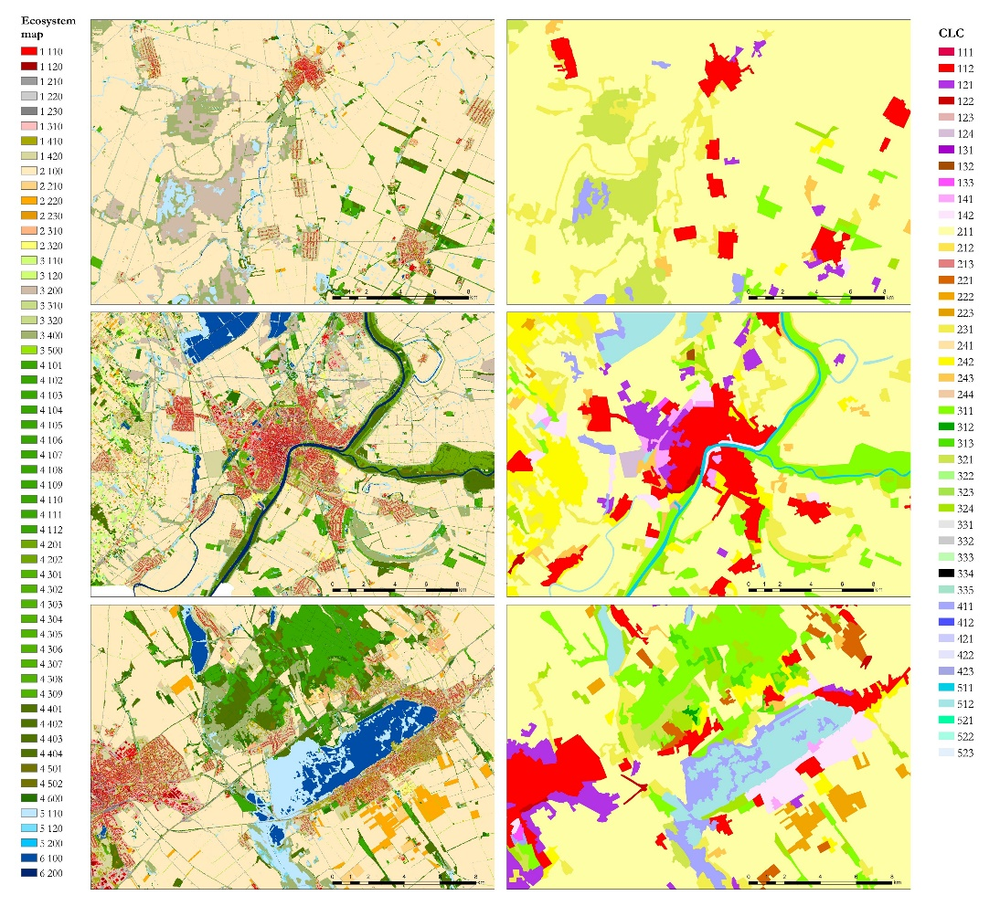

# Ecosystem Map of Hungary

## Short description 

The Ecosystem Map of Hungary shows the distribution, extent and frequency of ecosystem types on national-scale. Although, mapping of agricultural and urban ecosystems was also a goal, the primary target areas of mapping were semi-natural areas. The map is suitable to serve as the basis of all further assessments of Ecosystem Services and green infrastructure. Top-down and bottom-up mapping approaches were combined to execute mapping, relying both on existing and regularly updated thematic databases and remote sensing images.  
The map was created within the frame of an EU-co-financed project: "Strategic Assessments supporting the long-term conservation of natural values of community interest as well as the national implementation of the EU Biodiversity Strategy to 2020". (KEHOP-4.3.0-VEKOP-15-2016-00001).

## Mapping Methodology
The mapping methodology combined elements such as (1) image-based predictive mapping (using Random Forest classifier based on Sentinel-1,-2 and environmental data); (2) information derived from a (theoretical) data cube which was set up of various country-scale databases, and (3) high-level expert knowledge input (participatory method). The map is validated. 

## Typology

Hierarchical with three levels; six main categories at the first level (Level 1) and 56 at the most detailed third level. Level 1 corresponds to the MAES level 2 types with a few adjustments. [Typology_of_the_Ecosystem_Map_of_Hungary](https://raw.githubusercontent.com/eurodatacube/public-collections/main/collections/ecosystem/Typology_of_the_Ecosystem_Map_of_Hungary.pdf)

## Band information

Ecosystem Map of hungary has one band `ecosystem`. The band values correspond to the ecosystem categories described in this [excel sheet ](https://raw.githubusercontent.com/eurodatacube/public-collections/main/collections/ecosystem/ecosystem_nhrl_categories.csv) 

## More information

### Representative Images 

 

*Illustration of CLC vs Ecosystem basemap*
