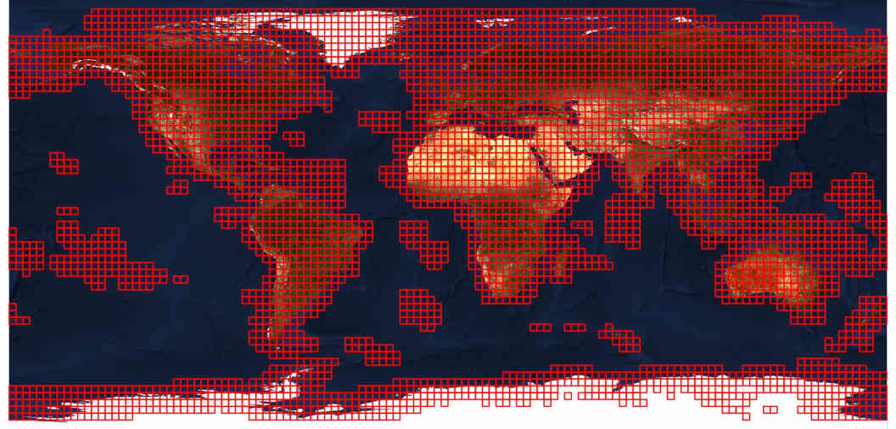
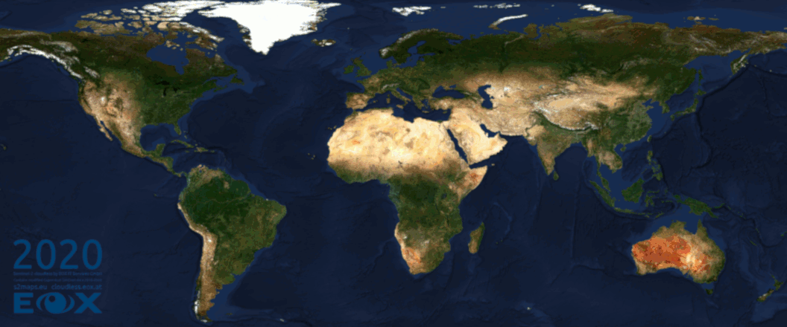
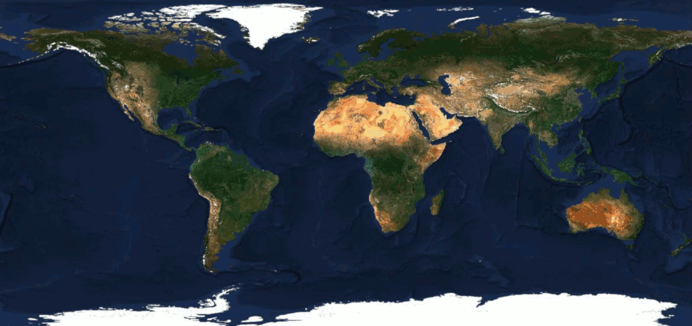
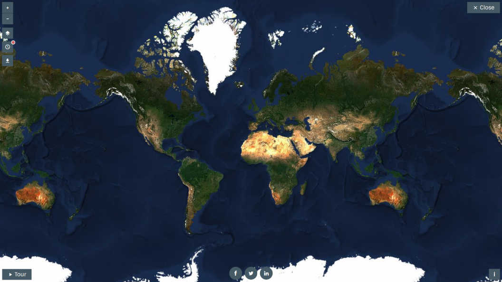

# EOxCloudless Sentinel-2 10m Global Mosaic

EOxCloudless Sentinel-2 10m Global Cloudless Mosaic is a derived product,
created to provide an almost cloudfree global dataset every year. For a detailed
description of the generally available products please refer to
[EOxCloudless](https://cloudless.eox.at/).

## EOxCloudless available at Euro Data Cube

The EOxCloudless data collection is available under the
[Insights On Demand](https://eurodatacube.com/marketplace/data-products/on-demand)
section of the EuroDataCube marketplace.

There is a minimum as well as a maximum price for purchasing a subset of the data
as shown in the table below.

| Year | Min. Price | Global Price | Price per Zone |
| -----|:-----------|--------------|----------------|
| 2021 | 800,- EUR | 16 000,- EUR | 5.0 EUR/Zone   |
| 2020 | 700,- EUR | 14 000,- EUR | 4.375 EUR/Zone |

Zones as mentioned in the table above are 2.813x2.813[degree] large squares in 
EPSG:4326 distributed over the Earth's landmasses. The distribution of these zones
for the EOxCloudless data is displayed in the image below. These zones are
used to calculate the price between the min. and max. (global) price for the 
EOxCloudless products.

 

## General EOxCloudless Product

The EOxCloudless products are readily available for the last recent years starting
from 2016 for the Viewing Products and 2018 for the Data Products.

### EOxCloudless Viewing Products

The EOxCloudless **Viewing Ready** single-file product is available in two formats and
two projections. It includes the three bands Red, Green, and Blue and is rendered as
regular JPEG images in `True Color`.

The available **projections** are:
* WGS84 lat/lon `EPSG:4326`
* Web Mercator `EPSG:3857`.

The available **formats** are:
* `GeoPackage`
* `MapCache SQLite` File

The EOxCloudless **Viewing Basic** GeoTIFFs product is available in the same
projections and provided as `GeoTIFF` TileDirectory.

### EOxCloudless Data Products

The EOxCloudless Data Products are available as `GeoTIFF` TileDirectories in
WGS84 lat/lon `EPSG:4326` projection and include the four 10[m] resolution bands Red, Green,
Blue, and NIR (B04, B03, B02, and B08).

They are offered in full Sentinel-2 data range as 16bit `GeoTIFF` TileDirectory - **Exploitation Ready** and
reduced data range as 8bit `GeoTIFF` TileDirectory - **Exploitation Starter**.
 
## Examples

 

*Example of a follow-up product created from the EOxCloudless using Blender*

----------------------------------

 

*Time-lapse of the world, showcasing EOxCloudless improvements over the years*

----------------------------------

 

*True Color, NDVI and False Color NIR versions of the 2021 Mosaic*

----------------------------------

 

*Showcase of the EOxCloudless Viewing Ready Product from the https://s2maps.eu/*
