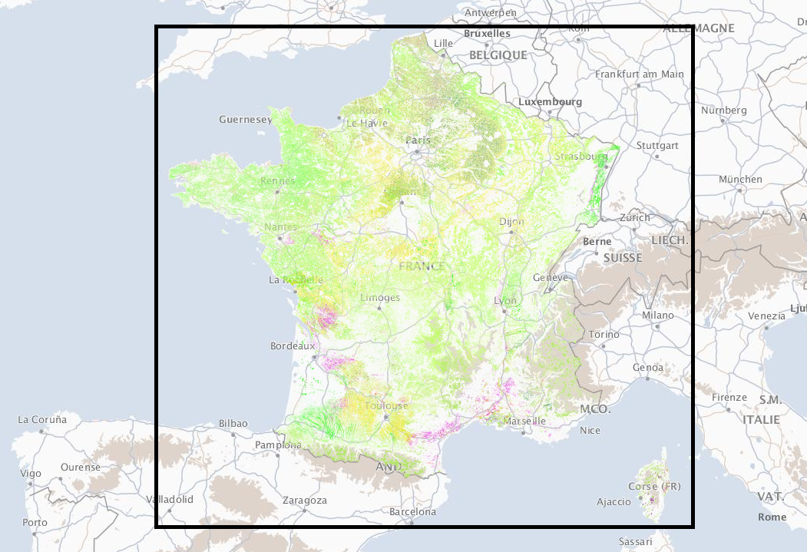

# France Metropolitan GSAA

## Short Description  

The Graphical Parcel Register (Registre parcellaire graphique (RPG) is a geographical database allowing the identification of agricultural parcels. Its primary purpose is to provide a spatial reference for aid applications under the Common Agricultural Policy (CAP). The anonymised version of RPG with information on the main crop on the agricultural parcel (before 2015, on farmer’s block) is publicly available. RGP is managed by the [Service and Payment Agency (ASP)](https://www.asp-public.fr/agency-services-and-payment) .   

In 2015, RPG version 1.0 was replaced by RPG version 2.0. Even if the two products both describe agricultural parcels on the French territory, their content is quite different. In version 1.0, the information is provided at the level of a farmer’s block, in 2.0, at the level of a parcel. Farmer’s blocks remain present in the RPG 2.0 data, but only as a separate shapefile with blocks’ ids and geometries.  

**Limitations** - the RPG data must be handled with caution:
-	not all of the agricultural land is included (e.g. agricultural land for which the aid application has not been submitted),
-	gaps mentioned above are not the same every year (e.g. general rules related to aids have changed), 
-	agricultural parcel (or in the data before 2015, farmer’s block) could be modified by the operator even though there was no change in the field.


## Coordinate Reference System
EPSG:2154 (RGF93 / Lambert-93 - France) , [more info](https://epsg.io/2154).  

Use the GDAL command below to convert the GSAA collection's CRS into CRS of your choice:

```
ogr2ogr [-s_srs srs_def] [-t_srs srs_def] [dstfile] [srcfile]
```
- `s_srs <srs_def>`: set source spatial reference
- `t_srs <srs_def>`: set target spatial reference
- `<dstfile>`: file with destination projection definition
- `<srcfile>`: file with source projection definition

Example of converting  from EPSG:2154 to EPSG:3857 
```
ogr2ogr -s_srs EPSG:2154 -t_srs EPSG:3857 gsaa_3857.shp gsaa_2154.shp
```

## Attribute Information  

### Table 1: Description of Attributes
<table>
  <thead>
    <tr>
      <th>Name</th>
      <th>Type </th>
      <th>Description</th>
    </tr>
  </thead>
  <tbody>
    <tr>
      <td>ID_PARCEL</td>
      <td >String</td>
      <td>Parcel identifier</td>
    </tr>
    <tr>
      <td>CODE_CULTU</td>
      <td >String </td>
      <td> Total geographical area covered by the block in hectares.</td>
    </tr>
    <tr>
      <td>CODE_GROUP</td>
      <td >String </td>
      <td>Code of the main crop group.</td>
    </tr>
    <tr>
      <td>CULTURE_D1</td>
      <td >String</td>
      <td >Code of the catch crop </td>
    </tr>
    <tr>
      <td>CULTURE_D2</td>
      <td >String </td>
      <td>Code of the second catch crop </td>
    </tr>
    <tr>
      <td>SURF_PARC</td>
      <td > Double </td>
      <td> Area of the parcel in hectares </td>
    </tr>
  </tbody>
</table>   

### Table 2: Description of the crop groups

| CODE_GROUP | French Description | English Description |
| ------- |  ------------ |---------|
| 1 | blé tendre | common wheat |
| 2 | maïs grain et ensilage | corn grain and silage |
| 3 | orge | barley |
| 4 | autres céréales | other cereals |
| 5 | colza | rape |
| 6 | tournesol | sunflower |
| 7 | autres oléagineux | other oilseeds |
| 8 | protéagineux | protein |
| 9 | plantes à fibres | fiber plants |
| 11 | gel (surfaces gelées sans production) | gel (frozen surfaces without production) |
| 14 | riz | rice |
| 15 | légumineuses à grains | grain legumes |
| 16 | fourrage | fodder |
| 17 | estives et landes | mountain pastures and moors |
| 18 | prairies permanentes | permanent grassland |
| 19 | prairies temporaires | temporary grassland |
| 20 | vergers | orchards |
| 21 | vignes | vineyards |
| 22 | fruits à coque | nuts |
| 23 | oliviers | olive trees |
| 24 | autres cultures industrielles | other industrial crops |
| 25 | légumes ou fleurs | vegetables or flowers |
| 26 | canne à sucre | sugar cane |
| 28 | divers | other |

## More Information

### References  

- [IGN geoservices](https://geoservices.ign.fr/documentation/diffusion/index.html)
- [Service and Payment Agency (ASP)](https://www.asp-public.fr)

### Online Resources    

- [Publicly available compressed ESRI shapefiles](https://geoservices.ign.fr/documentation/diffusion/telechargement-donnees-libres.html#rpg) updated annually. Download under ‘RPG’. The RPG data can be freely reused, also for commercial use, under the terms of the "open license" version 2.0.  

- [Open platform for French public data](https://www.data.gouv.fr/fr/datasets/registre-parcellaire-graphique-rpg-contours-des-parcelles-et-ilots-culturaux-et-leur-groupe-de-cultures-majoritaire/#_)

- [Archive](http://data.cquest.org/registre_parcellaire_graphique/)

### Geographic Location  

  
Source: ESRI National Geographic

