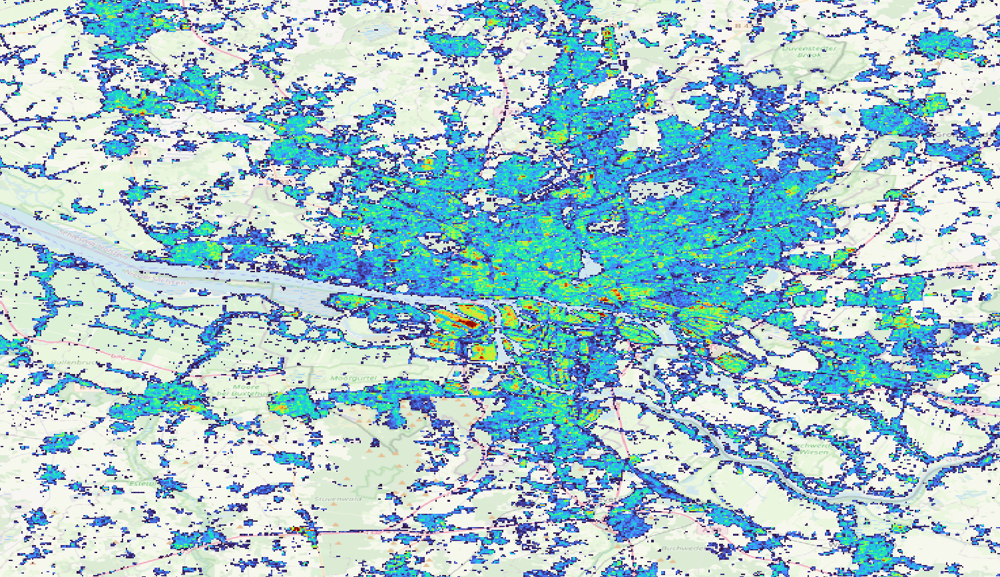

# GHS Built-up Surface

## Short description

The spatial raster dataset depicts the distribution of built-up surfaces, expressed as number of square metres. 
The data report about the total built-up surface and the built-up surface allocated to dominant non-residential (NRES) uses.
Data are spatial-temporal interpolated or extrapolated from 1975 to 2030 in 5 years intervals.

## References

### Dataset:

Pesaresi M., Politis P. (2023):  
GHS-BUILT-S R2023A - GHS built-up surface grid, derived from Sentinel2 composite and Landsat, multitemporal (1975-2030)European Commission, Joint Research Centre (JRC)  
PID: http://data.europa.eu/89h/9f06f36f-4b11-47ec-abb0-4f8b7b1d72ea, doi:10.2905/9F06F36F-4B11-47EC-ABB0-4F8B7B1D72EA  

### Concept & Methodology:

European Commission  
GHSL Data Package 2023, Publications Office of the European Union, Luxembourg, 2023, JRC133256, ISBN 978-92-68-02341-9  
doi:10.2760/098587  

## More information

- [Data Source](https://ghsl.jrc.ec.europa.eu/download.php?ds=bu)
- [Data Documentation](https://ghsl.jrc.ec.europa.eu/ghs_buS2023.php)

### Global Human Settlement Example

 
*Hamburg GHS_BUILT_S View (2020)*
