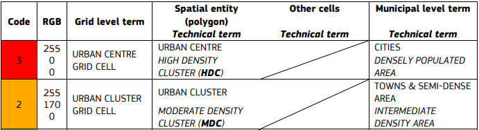
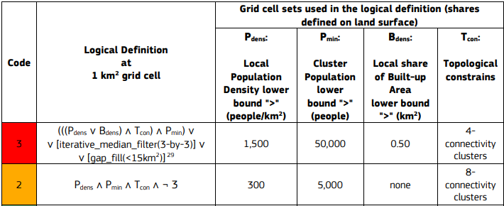
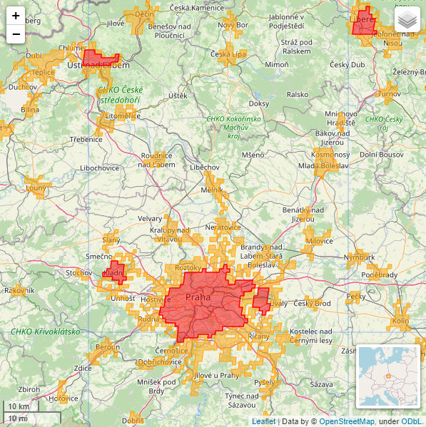
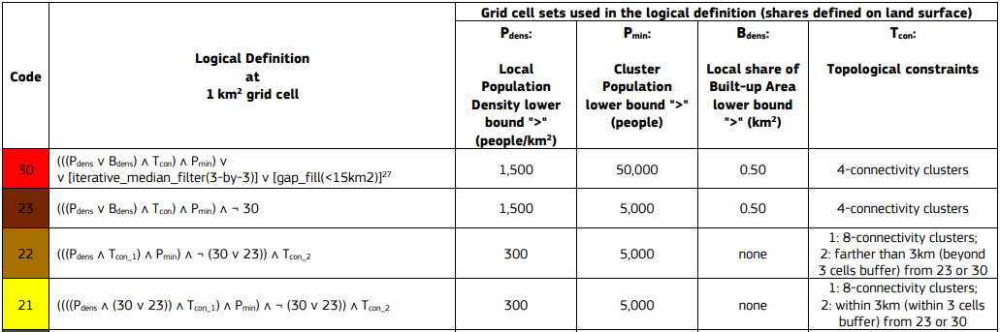
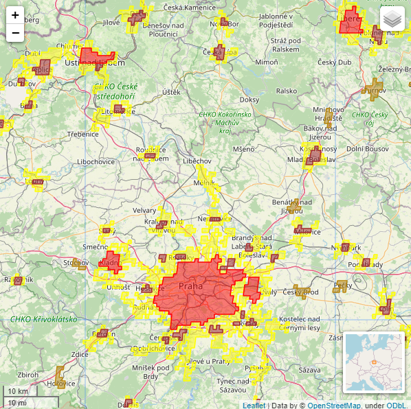

# Urban Delineation

## Short description 

Urban Delineation implements a GHSL settlement model algorithm as defined by the stage I of the Degree of Urbanisation (European Commission & Statistical Office of the European Union, 2021) and recommended by the UN STAT COM. Model uses the population and built-up surface grid - European Commission, Joint Research Centre (JRC)
The algorithm classifies and delineates settlements by typologies on two hierarchical levels.

At the first hierarchical level, the algorithm identifies the High Density Clusters (Urban Centre) and Moderate Density Clusters.

At the second hierarchical level, the algorithm identifies the High Density Clusters (Urban Centre), Dense Urban Clusters, Semi-Dense Urban Clusters and Peri-Urban Clusters.

## GHSL Data products

The Urban delineation algorithm combines two data products from the [Global Human Settlement Layer (GHSL) Data Package 2022](https://ghsl.jrc.ec.europa.eu/documents/GHSL_Data_Package_2022.pdf). Both are available as xcube datasets.

 GHS-BUILT-S R2022A - GHS built-up surface grid
 
 GHS-POP R2022A - GHS population grid 

#### GHSL products parameters
Spatial resolution: 1km

Coord. system: Mollweide (ESRI:54009)

Reference years: from 1975 to 2020, 5 years interval

## Results 

Shapefiles containing polygons of High Density Clusters (Urban Centre), Moderate Density Clusters, Dense Urban Clusters, Semi-Dense Urban Clusters and Peri-Urban Clusters in selected AOI and reference year. 

The polygons are projected onto the WGS84 coordinate reference system.

### First hierarchical level 

 
 
First hierarchical level - definition

 

 
 
First hierarchical level - result

 

 
 

### Second hierarchical level 

 
 
Second hierarchical level - definition

 

 
 
Second hierarchical level - result

 

 

## Pricing
[Details in PRICING.MD](https://collections.eurodatacube.com/ghsl-urban-delineation/pricing.html)
