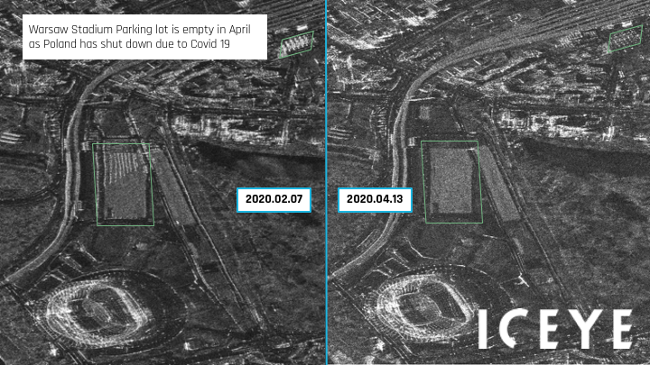

# ICEYE_E11a

## Short description

Warsaw Stadium Parking lot is empty in April as Poland has shut down due to Covid 19  
In Poland, the government declared lockdown restrictions in response to the pandemic in March - April 2020. In Warsaw, the capital city, a noticeable slowdown of activities has been observed.

## Band information

The product contains one single band named "GRD".

## More information

- [Data Source](https://www.iceye.com)
- [Data Documentation](https://www.iceye.com/hubfs/Downloadables/ICEYE-SAR-Product-Guide.pdf)
- [Links and resources](https://www.dw.com/en/coronavirus-threatens-polands-remarkable-growth-story/a-52939825)

 
*Warsaw Stadium Parking lot as viewed in high resolution*
