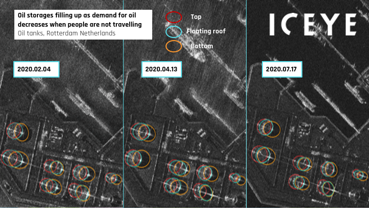

# ICEYE_E3

## Short description

Oil tanks in Rotterdam, Netherlands  
Oil storages filling up as demand for oil decreases when people are not travelling. The Oil sector has been facing a sudden decline in demand due to the Covid-19 pandemic. As oil prices dropped below zero for the first time in April 2020, storage tanks had never been so full. Rotterdam harbour is the european leader in oil storage, and the tanks' filling level can be observed on ICEYE imagery. In July, tanks were still very full.

## Band information

The product contains one single band named "GRD".

## More information

- [Data Source](https://www.iceye.com)
- [Data Documentation](https://www.iceye.com/hubfs/Downloadables/ICEYE-SAR-Product-Guide.pdf)
- [Links and resources](https://www.offshore-technology.com/comment/oil-storage-covid-19-impact/)

 
*Oil storages filling up as demand for oil decreases when people are not travelling. The image shows Oil tanks in Rotterdam, Netherlands*
