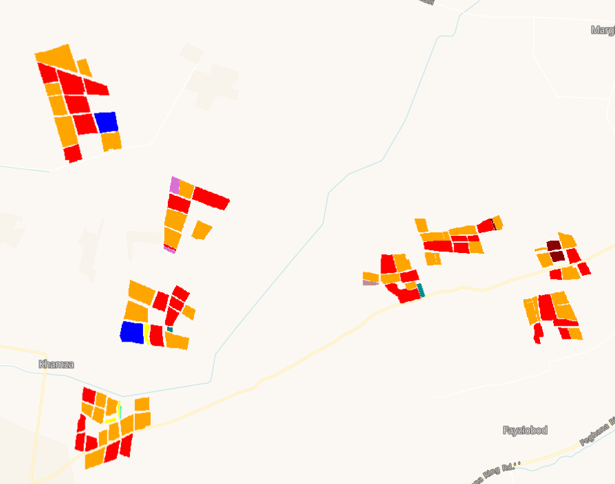

# Crop Types in Central Asia

## Short description

This dataset collection provides crop type dataset for consistent land cover classification in Central Asia. 8,196 samples were collected between 2015 and 2018, 213 in 2011 and 26 in 2008. The  data compiles samples for 40 crop types and is dominated by cotton (40%) and wheat, (25%). The data went through validation process using expert knowledge and remote sensing data and relied on transferable, open-source workflows that will assure the consistency of future sampling campaigns. This dataset (crop type information) is essential to understand the spatial distribution of water usage and anticipate the risk of water scarcity and the consequent danger of food insecurity especially to arid regions such as the Aral Sea Basin (ASB), Central Asia, where agriculture relies heavily on irrigation. More information can be found in the documentation page [[Source Cooperative](https://beta.source.coop/repositories/idiv/asia-crop-type/description)](https://beta.source.coop/repositories/idiv/asia-crop-type/description).

## Band information

The idiv land cover classification in Central Asia contains a crop type label and a season label to indicate the crop and the season in the field.

<table>
  <thead>
    <tr>
      <th>Band Name</th>
      <th>Sample Type</th>
      <th>Description</th>
    </tr>
  </thead>
  <tbody>
    <tr>
      <td>crop</td>
      <td >UINT 8</td>
      <td>Crop type</td>
    </tr>
    <tr>
      <td>season</td>
      <td >UINT 8</td>
      <td>Crop Season</td>
    </tr>
   </tbody>
</table>

### Crop type colouring scheme

<table>
  <thead>
    <tr>
      <th>Value</th>
      <th>Color</th>
      <th>Color Code</th>
      <th>Label</th>
    </tr>
  </thead>
<tbody>
    <tr>
      <td>1</td>
      <td bgcolor="#FF0000"></td>
      <td>#FF0000</td>
      <td>Cotton</td>
    </tr>
    <tr>
      <td>2</td>
      <td bgcolor="#00FF00"></td>
      <td>#00FF00</td>
      <td>Wheat-Other</td>
    </tr>
    <tr>
      <td>3</td>
      <td bgcolor="#0000FF"></td>
      <td>#0000FF</td>
      <td>Wheat</td>
    </tr>
    <tr>
      <td>4</td>
      <td bgcolor="#FFFF00"></td>
      <td>#FFFF00</td>
      <td>Orchard</td>
    </tr>
    <tr>
      <td>5</td>
      <td bgcolor="#FF00FF"></td>
      <td>#FF00FF</td>
      <td>Rice</td>
    </tr>
    <tr>
      <td>6</td>
      <td bgcolor="#00FFFF"></td>
      <td>#00FFFF</td>
      <td>Vegetables</td>
    </tr>
    <tr>
      <td>7</td>
      <td bgcolor="#800000"></td>
      <td>#800000</td>
      <td>Maize</td>
    </tr>
    <tr>
      <td>8</td>
      <td bgcolor="#008000"></td>
      <td>#008000</td>
      <td>Alfalfa</td>
    </tr>
    <tr>
      <td>9</td>
      <td bgcolor="#000080"></td>
      <td>#000080</td>
      <td>Wheat-Rice</td>
    </tr>
    <tr>
      <td>10</td>
      <td bgcolor="#808000"></td>
      <td>#808000</td>
      <td>Melons</td>
    </tr>
    <tr>
      <td>11</td>
      <td bgcolor="#800080"></td>
      <td>#800080</td>
      <td>Cotton-Other</td>
    </tr>
    <tr>
      <td>12</td>
      <td bgcolor="#008080"></td>
      <td>#008080</td>
      <td>Vineyard</td>
    </tr>
    <tr>
      <td>13</td>
      <td bgcolor="#808080"></td>
      <td>#808080</td>
      <td>Cotton-Rice</td>
    </tr>
    <tr>
      <td>14</td>
      <td bgcolor="#FFA500"></td>
      <td>#FFA500</td>
      <td>Wheat-Maize</td>
    </tr>
    <tr>
      <td>15</td>
      <td bgcolor="#D2B48C"></td>
      <td>#D2B48C</td>
      <td>Fallow</td>
    </tr>
    <tr>
      <td>16</td>
      <td bgcolor="#A0522D"></td>
      <td>#A0522D</td>
      <td>Wheat-Vegetables</td>
    </tr>
    <tr>
      <td>17</td>
      <td bgcolor="#8B0000"></td>
      <td>#8B0000</td>
      <td>Wheat-Sorghum</td>
    </tr>
    <tr>
      <td>18</td>
      <td bgcolor="#FF4500"></td>
      <td>#FF4500</td>
      <td>Wheat-Broom</td>
    </tr>
    <tr>
      <td>19</td>
      <td bgcolor="#FF6347"></td>
      <td>#FF6347</td>
      <td>Rice-Vegetables</td>
    </tr>
    <tr>
      <td>20</td>
      <td bgcolor="#8B4513"></td>
      <td>#8B4513</td>
      <td>Wheat-Soy</td>
    </tr>
    <tr>
      <td>21</td>
      <td bgcolor="#800000"></td>
      <td>#800000</td>
      <td>Wheat-Barley</td>
    </tr>
    <tr>
      <td>22</td>
      <td bgcolor="#008000"></td>
      <td>#008000</td>
      <td>Soy</td>
    </tr>
    <tr>
      <td>23</td>
      <td bgcolor="#8B008B"></td>
      <td>#8B008B</td>
      <td>Wheat-Cotton</td>
    </tr>
    <tr>
      <td>24</td>
      <td bgcolor="#008B8B"></td>
      <td>#008B8B</td>
      <td>Wheat-Carrot</td>
    </tr>
    <tr>
      <td>25</td>
      <td bgcolor="#8B5A2B"></td>
      <td>#8B5A2B</td>
      <td>Potato-Maize</td>
    </tr>
    <tr>
      <td>26</td>
      <td bgcolor="#006400"></td>
      <td>#006400</td>
      <td>Vegetables-Maize</td>
    </tr>
    <tr>
      <td>27</td>
      <td bgcolor="#CD853F"></td>
      <td>#CD853F</td>
      <td>Wheat-Carrots</td>
    </tr>
    <tr>
      <td>28</td>
      <td bgcolor="#2E8B57"></td>
      <td>#2E8B57</td>
      <td>Cabbages-Maize</td>
    </tr>
    <tr>
      <td>29</td>
      <td bgcolor="#008080"></td>
      <td>#008080</td>
      <td>Alfalfa-Maize</td>
    </tr>
    <tr>
      <td>30</td>
      <td bgcolor="#6B8E23"></td>
      <td>#6B8E23</td>
      <td>Wheat-Melons</td>
    </tr>
    <tr>
      <td>31</td>
      <td bgcolor="#1E90FF"></td>
      <td>#1E90FF</td>
      <td>Onions-Maize</td>
    </tr>
    <tr>
      <td>32</td>
      <td bgcolor="#90EE90"></td>
      <td>#90EE90</td>
      <td>Wheat-Beans</td>
    </tr>
    <tr>
      <td>33</td>
      <td bgcolor="#00FF7F"></td>
      <td>#00FF7F</td>
      <td>Sunflower</td>
    </tr>
    <tr>
      <td>34</td>
      <td bgcolor="#FF6347"></td>
      <td>#FF6347</td>
      <td>Carrots</td>
    </tr>
    <tr>
      <td>35</td>
      <td bgcolor="#FF4500"></td>
      <td>#FF4500</td>
      <td>Beans</td>
    </tr>
    <tr>
      <td>36</td>
      <td bgcolor="#FF69B4"></td>
      <td>#FF69B4</td>
      <td>Tomatoes</td>
    </tr>
    <tr>
      <td>37</td>
      <td bgcolor="#B8860B"></td>
      <td>#B8860B</td>
      <td>Onions</td>
    </tr>
    <tr>
      <td>38</td>
      <td bgcolor="#00CED1"></td>
      <td>#00CED1</td>
      <td>Oats</td>
    </tr>
    <tr>
      <td>39</td>
      <td bgcolor="#8B4513"></td>
      <td>#8B4513</td>
      <td>Potatoes</td>
    </tr>
    <tr>
      <td>40</td>
      <td bgcolor="#000000"></td>
      <td>#000000</td>
      <td>Pumpkin</td>
    </tr>
</tbody>
</table>

## More information

More information about A crop type dataset for consistent land cover classification in central Asia collection is described on the [Source Cooperative](https://beta.source.coop/repositories/idiv/asia-crop-type/description) (previously Radiant MLHub) and the documentation can be downloaded [here](https://data.source.coop/idiv/asia-crop-type/documentation.pdf).

### Representative Images

*Crop types recorded in central Asia from 2008 to 2018.*
