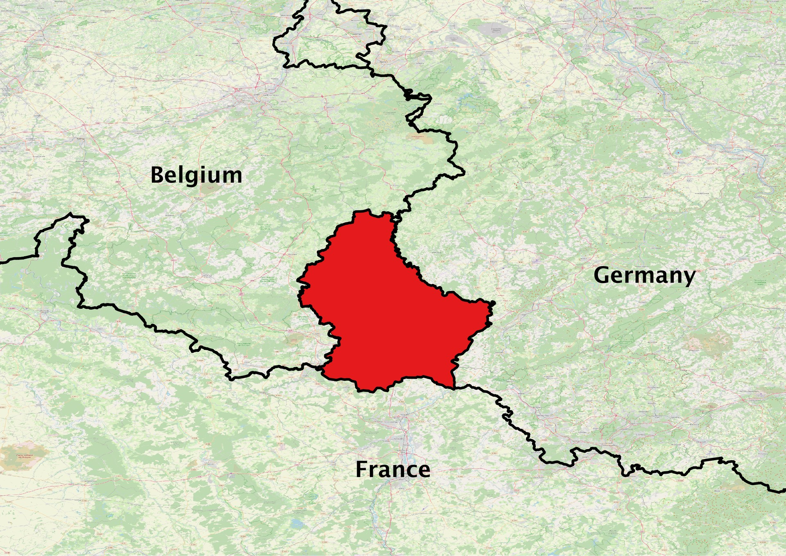

# Luxembourg LPIS

## Short Description  

Luxembourg's Land Parcel Identification System (LPIS) is managed by [The Administration of Technical Agricultural Services (ASTA)](https://mavpc.gouvernement.lu/fr/administrations/asta.html). The data is made available to the public on [The Luxembourg Data Platform](https://data.public.lu/fr/datasets/referentiel-des-parcelles-flik/) based on the Creative Commons 1.0 Universal (CC0 1.0) Public Domain Dedication. In addition, it is possible to query parcels’ information on the [Geoportal](http://agriculture.geoportail.lu/) under the 'Agriculture' theme.

The plot-based parcel reference system (FLIK) in Luxembourg was digitally recorded for the first time in 2005 based on aerial photos. Since then, the system has been continuously revised via the latest aerial images.Onsite measurements using GPS are carried out for unclear boundaries cases as well an assessment of the parcels’ eligibility for payment.

The FLIK parcels are categorized into eligible agricultural parcels, eligible vineyard parcels, ineligible parcels, and non-payable objects. The data has been uploaded to geoDB and is available from 2016 to 2021 annually with updates expected annually. 

## Coordinate Reference System
EPSG:2169 (Luxembourg 1930 / Gauss), [more info](http://epsg.io/2169)  


Use the GDAL command below to convert the LPIS collection's CRS into CRS of your choice:

```
ogr2ogr [-s_srs srs_def] [-t_srs srs_def] [dstfile] [srcfile]
```
- `s_srs <srs_def>`: set source spatial reference
- `t_srs <srs_def>`: set target spatial reference
- `<dstfile>`: file with destination projection definition
- `<srcfile>`: file with source projection definition

Example of converting  from EPSG:2169 to EPSG:3857 
```
ogr2ogr -s_srs EPSG:2169 -t_srs EPSG:3857 lpis_3857.shp lpis_2169.shp
```

## Attribute Information
<table>
  <thead>
    <tr>
      <th>Name</th>
      <th>Type </th>
      <th>Description</th>
    </tr>
  </thead>
  <tbody>
    <tr>
      <td>FLIK</td>
      <td >String</td>
      <td>Parcel's record number.</td>
    </tr>
    <tr>
      <td>CODE_ELEM</td>
      <td >String </td>
      <td>Category of the registered parcel.</td>
    </tr>
    <tr>
      <td>CODE_COM</td>
      <td >String </td>
      <td>Name of the commune where the parcel lies.</td>
    </tr>
    <tr>
      <td>CODE_SECT</td>
      <td >String </td>
      <td >The cadastral section where the parcel lies.</td>
    </tr>
    <tr>
      <td>SURF_ELEM</td>
      <td >Float </td>
      <td>The area of the parcel.</td>
    </tr>
    <tr>
      <td>SURFACE</td>
      <td >Float </td>
      <td>The area of the parcel.</td>
    </tr>
    <tr>
      <td>PERIM_REEL</td>
      <td >Float </td>
      <td>The perimeter of the parcel.</td>
    </tr>
    <tr>
      <td>PERIMETRE</td>
      <td >Float </td>
      <td>The perimeter of the parcel.</td>
    </tr>
    <tr>
      <td>ENVIR</td>
      <td >String</td>
      <td>Environmentally sensitive grassland.</td>
    </tr>
  </tbody>
</table>    


### Description of parcels categories (CODE_ELEM)
| CODE_ELEM | Description |
|---|---|
|P|Eligible agricultural parcel with the exception of vineyards|
|V|Eligible vineyard parcel|
|D|Ineligible parcel / non-agricultural areas|
|N|Non-payable objects, e.g., electric mast, wind turbine|

## More Information

### References  

- [The Luxembourg agricultural portal](https://agriculture.public.lu/de/betriebsfuhrung/gis.html), The Geographic Information System section

- [April 28, 2017 Grand-Ducal Regulation](http://legilux.public.lu/eli/etat/leg/rgd/2017/04/28/a490/jo) on the methods for updating and maintaining the identification system for agricultural parcels based on computerized techniques of a geographic information system.   

### Online Resources    

- Publicly available compressed ESRI Shapefiles, updated annually since 2016 on  [The Luxembourg Data Platform](https://data.public.lu/fr/datasets/referentiel-des-parcelles-flik/). There are no limitations to the use of these data.   

- [The national geoportal of the Grand-Duchy of Luxembourg](https://map.geoportail.lu/theme/agriculture?lang=en&version=3&zoom=10&X=667917&Y=6394482&rotation=0&layers=1637&opacities=1&bgLayer=orthogr_2013_global), the governmental platform to collect, describe, show and deliver geospatial data and related products. 

- [The Luxembourg Catalog INSPIRE Geoportal](https://catalog.inspire.geoportail.lu/geonetwork/srv/eng/catalog.search#/home) with “FLIK” as the search word.

### Geographic Location

Source: OpenStreetMap

