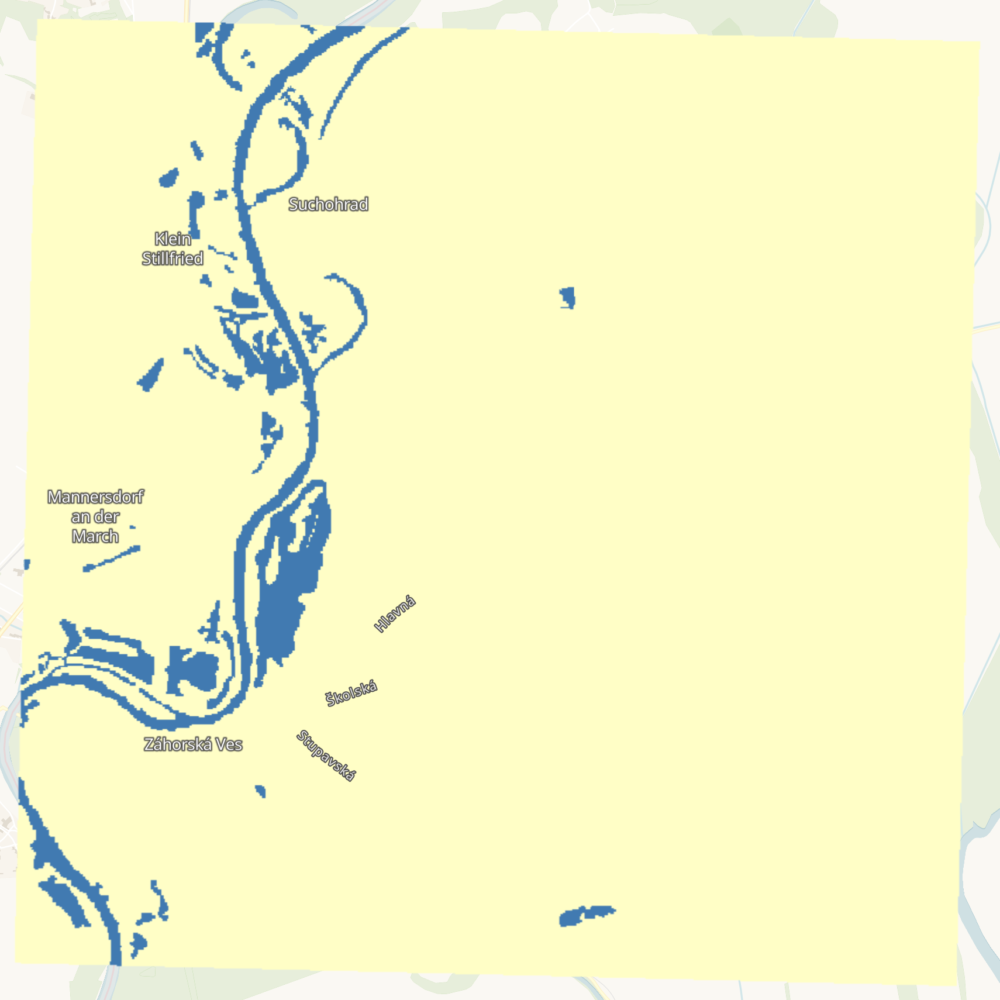

# Cloud to Street - Microsoft Flood Dataset - Sentinel-1

## Short description

The Cloud to Street - Microsoft Flood Dataset (C2S-MS Floods) is a dataset of near-coincident Sentinel-1 and Sentinel-2 data paired with water labels from 18 global flood events. These labels are derived products of MODIS sensor on board NASA's Aqua and Terra satellites produced as a part of the study, "Satellite imaging reveals increased proportion of population exposed to floods," Nature (2021), doi: 10.1038/s41586-021-03695-w. 

In this collection, we keep the water label which represents the maximum observed flood extent during the time period of the event. For a detailed description of the methods used to generate these labels, please refer to the original paper.

## Band information

The C2S-MS Floods - Sentinel-1 contains a water label representing the flood extent.

<table>
  <thead>
    <tr>
      <th>Band Name</th>
      <th>Sample Type</th>
      <th>Expected Values</th>
      <th>Description</th>
    </tr>
  </thead>
  <tbody>
    <tr>
      <td>water</td>
      <td >UINT 8</td>
      <td>0 - no water, 1 - water, 255 - no data</td>
      <td>Flood extent</td>
    </tr>         
   </tbody>
</table>

## More information

More information about the C2S-MS Floods is described on the [Source Cooperative](https://beta.source.coop/repositories/c2sms/c2smsfloods/description) (previously Radiant MLHub) and the methodology and workflow is outlined in the [study](https://www.nature.com/articles/s41586-021-03695-w).

### Representative Images

*Flood extent near Suchohrad, Slovakia in 2020.*
