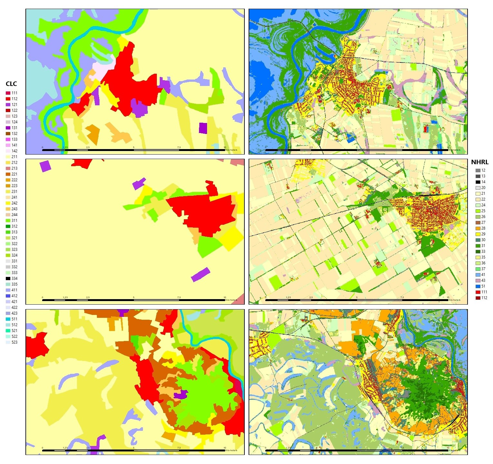

# National High Resolution Layer, Hungary

## Short description 

The concept of the NHRL was to create a dataset that provides wall-to-wall information on land cover, especially on land cover categories that can be more reliably identified by remote sensing methods. Its classification mixes land use and land cover elements according to human interest, providing map information from the built environment to agricultural cultivated areas and natural vegetation cover.  
In addition to the machine-learning process (Random Forest), its production includes data integration (roads - railways - buildings) and other data filtering steps to reduce data noise.  
In the future, this yearly dataset could provide the basis for the production of visually verified change data with a reduced nomenclature. The data published here is not suitable for change detection in its present form.

## Mapping Methodology
The mapping methodology combined elements such as (1) image-based predictive mapping (using Random Forest classifier based on Sentinel-1,-2 and environmental data); (2) information derived from a (theoretical) data cube which was set up of various country-scale databases, and (3) high-level expert knowledge input (participatory method). 

## Typology

Its classification is non-hierarchical, but it can be simplified by thematically aggregating certain classes. For a purpose-specific and efficient use, it is important to take into account the real content of the classes and the range of additional data required. 

## Band information

National High Resolution Layer has one band `nhrl`. The band values correspond to land cover classes described in Table 1 below.  
  
### Table 1: National High Resolution Layer nomenclature 

<table>
  <thead>
    <tr>
      <th>Value</th>
      <th>Color</th>
      <th>Color Code</th>
      <th>Label</th>
    </tr>
  </thead>
  <tbody>
    <tr>
      <td>111</td>
      <td bgcolor="#FF0000"></td>
      <td>#FF0000</td>
      <td>111 Single-floor buildings</td>
    </tr>
    <tr>
      <td>112</td>
      <td bgcolor="#A80000"></td>
      <td>#A80000</td>
      <td>112 High buildings</td>
    </tr>
    <tr>
      <td>12</td>
      <td bgcolor="#828282"></td>
      <td>#828282</td>
      <td>12 Other paved or non-paved artificial surfaces</td>
    </tr>
    <tr>
      <td>13</td>
      <td bgcolor="#4E4E4E"></td>
      <td>#4E4E4E</td>
      <td>13 Road network</td>
    </tr>
    <tr>
      <td>14</td>
      <td bgcolor="#00000"></td>
      <td>#000000</td>
      <td>14 Railway network</td>
    </tr>
    <tr>
      <td>20</td>
      <td bgcolor="#E1E1E1"></td>
      <td>#E1E1E1</td>
      <td>20 Bare soil (natural bare surfaces)</td>
    </tr>
    <tr>
      <td>21</td>
      <td bgcolor="#FFFFBE"></td>
      <td>#FFFFBE</td>
      <td>21 Cereals</td>
    </tr>
    <tr>
      <td>22</td>
      <td bgcolor="#ffebaf"></td>
      <td>#FFEBAF</td>
      <td>22 Row crops</td>
    </tr>
    <tr>
      <td>24</td>
      <td bgcolor="#d3ffbe"></td>
      <td>#D3FFBE</td>
      <td>24 Alfalfa </td>
    </tr>
    <tr>
      <td>25</td>
      <td bgcolor="#aaff00"></td>
      <td>#AAFF00</td>
      <td>25 Rapeseed</td>
    </tr>
    <tr>
      <td>26</td>
      <td bgcolor="#ABFF66"></td>
      <td>#ABFF66</td>
      <td>26 Grassland</td>
    </tr>
    <tr>
      <td>27</td>
      <td bgcolor="#B0643C"></td>
      <td>#B0643C</td>
      <td>27 Orchards</td>
    </tr>
    <tr>
      <td>28</td>
      <td bgcolor="#FFAA00"></td>
      <td>#FFAA00</td>
      <td>28 Vineyards</td>
    </tr>
    <tr>
      <td>29</td>
      <td bgcolor="#FFFF00"></td>
      <td>#FFFF00</td>
      <td>29 Heterogeneous vegetated surfaces in built-up environment</td>
    </tr>
    <tr>
      <td>30</td>
      <td bgcolor="#448970"></td>
      <td>#448970</td>
      <td>30 Shrubland</td>
    </tr>
    <tr>
      <td>31</td>
      <td bgcolor="#19A800"></td>
      <td>#19A800</td>
      <td>31 Broadleaved trees</td>
    </tr>
    <tr>
      <td>33</td>
      <td bgcolor="#267300"></td>
      <td>#267300</td>
      <td>33 Coniferous trees </td>
    </tr>
    <tr>
      <td>35</td>
      <td bgcolor="#F5F57A"></td>
      <td>#F5F57A</td>
      <td>35 Grasslands with shrubs</td>
    </tr>
    <tr>
      <td>36</td>
      <td bgcolor="#CDF57A"></td>
      <td>#CDF57A</td>
      <td>36 Heterogeneous grassland with periodic water effect</td>
    </tr>
    <tr>
      <td>37</td>
      <td bgcolor="#67F070"></td>
      <td>#67F070</td>
      <td>37 Salt steppes and meadows</td>
    </tr>
    <tr>
      <td>41</td>
      <td bgcolor="#73B2FF"></td>
      <td>#73B2FF</td>
      <td> 41 Wetlands </td>
    </tr>
    <tr>
      <td>43</td>
      <td bgcolor="#D69DBC"></td>
      <td>#D69DBC</td>
      <td>43 Reeds</td>
    </tr>
    <tr>
      <td>51</td>
      <td bgcolor="#0070FF"></td>
      <td>#0070FF</td>
      <td>51 Water surfaces</td>
    </tr>
  </tbody>
</table>

## More information

### Representative Images

 

*Illustration of CLC vs NHRL*  
