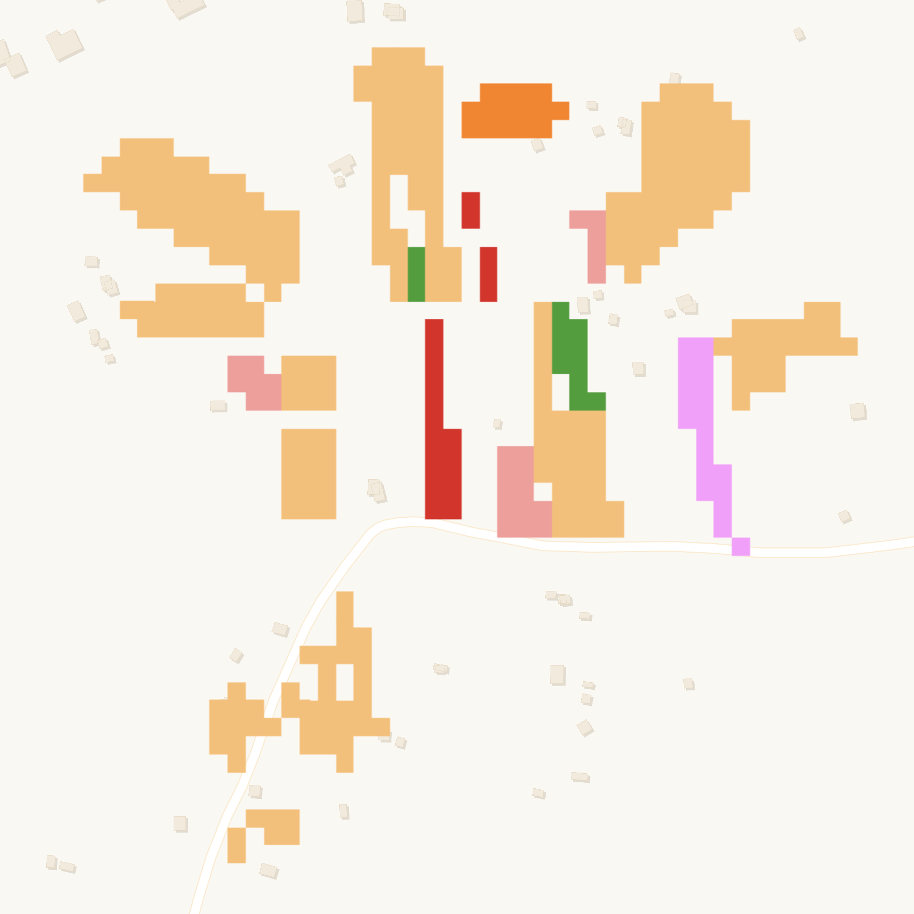

# PlantVillage Crop Type Kenya

## Short description

The PlantVillage Crop Type Kenya is a dataset that contains field boundaries and crop type information for fields in Kenya. The crop information is collected in situ using the PlantVillage app. This collection has been rasterised from the original vector data at 10 m resolution to be paired with Sentinel-1 & Sentinel-2 imagery. 

## Band information

The PlantVillage Crop Type Kenya collection contains a crop type label and a crop density label to indicate the major crop in the field and the estimated density of the field.

<table>
  <thead>
    <tr>
      <th>Band Name</th>
      <th>Sample Type</th>
      <th>Description</th>
    </tr>
  </thead>
  <tbody>
    <tr>
      <td>crop</td>
      <td >UINT 8</td>
      <td>Crop type</td>
    </tr>
    <tr>
      <td>crop_density</td>
      <td >FLOAT 32</td>
      <td>Crop density</td>
    </tr>
   </tbody>
</table>

### Crop type colouring scheme

<table>
  <thead>
    <tr>
      <th>Value</th>
      <th>Color</th>
      <th>Color Code</th>
      <th>Label</th>
    </tr>
  </thead>
  <tbody>
    <tr>
      <td>1</td>
      <td bgcolor="#a6cee3"></td>
      <td>#a6cee3</td>
      <td>Banana</td>
    </tr>
    <tr>
      <td>2</td>
      <td bgcolor="#1f78b4"></td>
      <td>#1f78b4</td>
      <td>Bean</td>
    </tr>
    <tr>
      <td>3</td>
      <td bgcolor="#b2df8a"></td>
      <td>#b2df8a</td>
      <td>Cabbage</td>
    </tr>
    <tr>
      <td>4</td>
      <td bgcolor="#33a02c"></td>
      <td>#33a02c</td>
      <td>Cassavas</td>
    </tr>
    <tr>
      <td>5</td>
      <td bgcolor="#fb9a99"></td>
      <td>#fb9a99</td>
      <td>Fallowland</td>
    </tr>
    <tr>
      <td>6</td>
      <td bgcolor="#e31a1c"></td>
      <td>#e31a1c</td>
      <td>Groundnut</td>
    </tr>
    <tr>
      <td>7</td>
      <td bgcolor="#fdbf6f"></td>
      <td>#fdbf6f</td>
      <td>Maize</td>
    </tr>
    <tr>
      <td>8</td>
      <td bgcolor="#ff7f00"></td>
      <td>#ff7f00</td>
      <td>Millet</td>
    </tr>
    <tr>
      <td>9</td>
      <td bgcolor="#cab2d6"></td>
      <td>#cab2d6</td>
      <td>Sorghum</td>
    </tr>
    <tr>
      <td>10</td>
      <td bgcolor="#6a3d9a"></td>
      <td>#6a3d9a</td>
      <td>Soybean</td>
    </tr>
    <tr>
      <td>11</td>
      <td bgcolor="#ffff99"></td>
      <td>#ffff99</td>
      <td>Sugarcane</td>
    </tr>
    <tr>
      <td>12</td>
      <td bgcolor="#b15928"></td>
      <td>#b15928</td>
      <td>Sweetpotato</td>
    </tr>
    <tr>
      <td>13</td>
      <td bgcolor="#ff99ff"></td>
      <td>#ff99ff</td>
      <td>Tomato</td>
    </tr>
  </tbody>
</table>

### Crop density colouring schema

<table>
  <thead>
    <tr>
      <th>Value</th>
      <th>Color</th>
      <th>Color Code</th>
      <th>Label</th>
    </tr>
  </thead>
  <tbody>
    <tr>
      <td>1</td>
      <td bgcolor="#000000"></td>
      <td>#000000</td>
      <td>1% confidence</td>
    </tr>
    <tr>
      <td>100</td>
      <td bgcolor="#00c800"></td>
      <td>#00c800</td>
      <td>100% confidence</td>
    </tr>
  </tbody>
</table>

## More information

More information about the PlantVillage Crop Type Kenya collection is described on the [Source Cooperative](https://beta.source.coop/repositories/radiantearth/african-crops-kenya-01/description) (previously Radiant MLHub) and the documentation can be downloaded [here](https://data.source.coop/radiantearth/african-crops-kenya-01/Kenya_Documentation.pdf).

### Representative Images

*Crop types recorded in western Kenya in 2019.*
