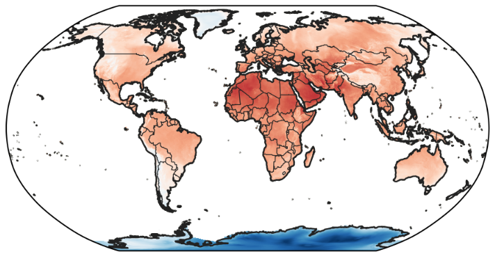

# ERA5-Land monthly averaged data 

## Short description

[The European Centre for Medium-Range Weather Forecasts (ECMWF)](https://www.ecmwf.int/) produces ERA5-Land dataset within the frame of 
 [Copernicus Climate Change Service](https://www.copernicus.eu/en/copernicus-services/climate-change).
 ERA5-Land  is a replay of the land component of the ERA5 climate reanalysis with a finer native resolution of 9km compared to 31km in ERA5 and an improved
 computational efficiency. The data in the [Climate Data Store (CDS)](https://cds.climate.copernicus.eu/#!/home) has been regridded to a regular lat-lon grid of 0.1x0.1 degrees.
 ERA5-Land dataset describes the evolution of the water and energy cycles over land in a consistent manner over the production period. 
 By combining model data and observations that goes back several decades in time, reanalysis provides an accurate description of the climate of the past.
 ERA5-Land monthly averaged data is a post-processed subset of the full ERA5-Land dataset representing pre-calculated monthly-mean averages
 to facilitate  quick and easy access when sub-monthly data is not required. 
 The temporal and spatial resolutions of ERA5-Land makes it very useful for land surface monitoring applications such as flood or drought forecasting.
 Visit [ERA5-Land documentation] for more information. 

## Variables    

### Table 1: specification of the main variables   
| Name    | Full Name                                             | Units                 | Description                                                                                                                                                                                                                                                                                                                                                                                                                                                                                                                                                                                                                                                                                                                                                                                                                                                                                                                                                                                                                                                                                                                                                                                                                |
| ------- | ----------------------------------------------------- | --------------------- | -------------------------------------------------------------------------------------------------------------------------------------------------------------------------------------------------------------------------------------------------------------------------------------------------------------------------------------------------------------------------------------------------------------------------------------------------------------------------------------------------------------------------------------------------------------------------------------------------------------------------------------------------------------------------------------------------------------------------------------------------------------------------------------------------------------------------------------------------------------------------------------------------------------------------------------------------------------------------------------------------------------------------------------------------------------------------------------------------------------------------------------------------------------------------------------------------------------------------- |
| u10     | 10m u-component of wind                               | m s\-1                | Eastward component of the 10m wind. It is the horizontal speed of air moving towards the east, at a height of ten metres above the surface of the Earth, in metres per second. Care should be taken when comparing this variable with observations, because wind observations vary on small space and time scales and are affected by the local terrain, vegetation and buildings that are represented only on average in the ECMWF Integrated Forecasting System. This variable can be combined with the V component of 10m wind to give the speed and direction of the horizontal 10m wind.                                                                                                                                                                                                                                                                                                                                                                                                                                                                                                                                                                                                                              |
| v10     | 10m v-component of wind                               | m s\-1                | Northward component of the 10m wind. It is the horizontal speed of air moving towards the north, at a height of ten metres above the surface of the Earth, in metres per second. Care should be taken when comparing this variable with observations, because wind observations vary on small space and time scales and are affected by the local terrain, vegetation and buildings that are represented only on average in the ECMWF Integrated Forecasting System. This variable can be combined with the U component of 10m wind to give the speed and direction of the horizontal 10m wind.                                                                                                                                                                                                                                                                                                                                                                                                                                                                                                                                                                                                                            |
| d2m     | 2m dewpoint temperature                               | K                     | Temperature to which the air, at 2 metres above the surface of the Earth, would have to be cooled for saturation to occur.It is a measure of the humidity of the air. Combined with temperature and pressure, it can be used to calculate the relative humidity. 2m dew point temperature is calculated by interpolating between the lowest model level and the Earth's surface, taking account of the atmospheric conditions. Temperature measured in kelvin can be converted to degrees Celsius (°C) by subtracting 273.15.                                                                                                                                                                                                                                                                                                                                                                                                                                                                                                                                                                                                                                                                                              |
| t2m     | 2m temperature                                        | K                     | Temperature of air at 2m above the surface of land, sea or in-land waters. 2m temperature is calculated by interpolating between the lowest model level and the Earth's surface, taking account of the atmospheric conditions. Temperature measured in kelvin can be converted to degrees Celsius (°C) by subtracting 273.15.                                                                                                                                                                                                                                                                                                                                                                                                                                                                                                                                                                                                                                                                                                                                                                                                                                                                                              |
| e       | Evaporation                                           | m of water equivalent | Accumulated amount of water that has evaporated from the Earth's surface, including a simplified representation of transpiration (from vegetation), into vapour in the air above. This variable is accumulated from the beginning of the forecast to the end of the forecast step. The ECMWF Integrated Forecasting System convention is that downward fluxes are positive. Therefore, negative values indicate evaporation and positive values indicate condensation.                                                                                                                                                                                                                                                                                                                                                                                                                                                                                                                                                                                                                                                                                                                                                     |
| evabs   | Evaporation from bare soil                            | m of water equivalent | The amount of evaporation from bare soil at the top of the land surface. This variable is accumulated from the beginning of the forecast time to the end of the forecast step.                                                                                                                                                                                                                                                                                                                                                                                                                                                                                                                                                                                                                                                                                                                                                                                                                                                                                                                                                                                                                                             |
| evaow   | Evaporation from open water surfaces excluding oceans | m of water equivalent | Amount of evaporation from surface water storage like lakes and inundated areas but excluding oceans. This variable is accumulated from the beginning of the forecast time to the end of the forecast step.                                                                                                                                                                                                                                                                                                                                                                                                                                                                                                                                                                                                                                                                                                                                                                                                                                                                                                                                                                                                                |
| evatc   | Evaporation from the top of canopy                    | m of water equivalent | The amount of evaporation from the canopy interception reservoir at the top of the canopy. This variable is accumulated from the beginning of the forecast time to the end of the forecast step.                                                                                                                                                                                                                                                                                                                                                                                                                                                                                                                                                                                                                                                                                                                                                                                                                                                                                                                                                                                                                           |
| evavt   | Evaporation from vegetation transpiration             | m of water equivalent | Amount of evaporation from vegetation transpiration. This has the same meaning as root extraction i.e. the amount of water extracted from the different soil layers. This variable is accumulated from the beginning of the forecast time to the end of the forecast step.                                                                                                                                                                                                                                                                                                                                                                                                                                                                                                                                                                                                                                                                                                                                                                                                                                                                                                                                                 |
| fal     | Forecast albedo                                       | dimensionless         | Is a measure of the reflectivity of the Earth's surface. It is the fraction of solar (shortwave) radiation reflected by Earth's surface, across the solar spectrum, for both direct and diffuse radiation. Values are between 0 and 1. Typically, snow and ice have high reflectivity with albedo values of 0.8 and above, land has intermediate values between about 0.1 and 0.4 and the ocean has low values of 0.1 or less. Radiation from the Sun (solar, or shortwave, radiation) is partly reflected back to space by clouds and particles in the atmosphere (aerosols) and some of it is absorbed. The rest is incident on the Earth's surface, where some of it is reflected. The portion that is reflected by the Earth's surface depends on the albedo. In the ECMWF Integrated Forecasting System (IFS), a climatological background albedo (observed values averaged over a period of several years) is used, modified by the model over water, ice and snow. Albedo is often shown as a percentage (%).                                                                                                                                                                                                       |
| lblt    | Lake bottom temperature                               | K                     | Temperature of water at the bottom of inland water bodies (lakes, reservoirs, rivers) and coastal waters. ECMWF implemented a lake model in May 2015 to represent the water temperature and lake ice of all the world’s major inland water bodies in the Integrated Forecasting System. The model keeps lake depth and surface area (or fractional cover) constant in time.                                                                                                                                                                                                                                                                                                                                                                                                                                                                                                                                                                                                                                                                                                                                                                                                                                                |
| licd    | Lake ice depth                                        | m                     | The thickness of ice on inland water bodies (lakes, reservoirs and rivers) and coastal waters. The ECMWF Integrated Forecasting System (IFS) represents the formation and melting of ice on inland water bodies (lakes, reservoirs and rivers) and coastal water. A single ice layer is represented. This parameter is the thickness of that ice layer.                                                                                                                                                                                                                                                                                                                                                                                                                                                                                                                                                                                                                                                                                                                                                                                                                                                                    |
| lict    | Lake ice temperature                                  | K                     | The temperature of the uppermost surface of ice on inland water bodies (lakes, reservoirs, rivers) and coastal waters. The ECMWF Integrated Forecasting System represents the formation and melting of ice on lakes. A single ice layer is represented. The temperature measured in kelvin can be converted to degrees Celsius (°C) by subtracting 273.15.                                                                                                                                                                                                                                                                                                                                                                                                                                                                                                                                                                                                                                                                                                                                                                                                                                                                 |
| lmld    | Lake mix-layer depth                                  | m                     | The thickness of the upper most layer of an inland water body (lake, reservoirs, and rivers) or coastal waters that is well mixed and has a near constant temperature with depth (uniform distribution of temperature). The ECMWF Integrated Forecasting System represents inland water bodies with two layers in the vertical, the mixed layer above and the thermocline below. Thermoclines upper boundary is located at the mixed layer bottom, and the lower boundary at the lake bottom. Mixing within the mixed layer can occur when the density of the surface (and near-surface) water is greater than that of the water below. Mixing can also occur through the action of wind on the surface of the lake.                                                                                                                                                                                                                                                                                                                                                                                                                                                                                                       |
| lmlt    | Lake mix-layer temperature                            | K                     | The temperature of the upper most layer of inland water bodies (lakes, reservoirs and rivers) or coastal waters) that is well mixed. The ECMWF Integrated Forecasting System represents inland water bodies with two layers in the vertical, the mixed layer above and the thermocline below. Thermoclines upper boundary is located at the mixed layer bottom, and the lower boundary at the lake bottom. Mixing within the mixed layer can occur when the density of the surface (and near-surface) water is greater than that of the water below. Mixing can also occur through the action of wind on the surface of the lake. Temperature measured in kelvin can be converted to degrees Celsius (°C) by subtracting 273.15.                                                                                                                                                                                                                                                                                                                                                                                                                                                                                           |
| lshf    | Lake shape factor                                     | dimensionless         | This parameter describes the way that temperature changes with depth in the thermocline layer of inland water bodies (lakes, reservoirs and rivers) and coastal waters. It is used to calculate the lake bottom temperature and other lake-related parameters. The ECMWF Integrated Forecasting System represents inland and coastal water bodies with two layers in the vertical, the mixed layer above and the thermocline below where temperature changes with depth.                                                                                                                                                                                                                                                                                                                                                                                                                                                                                                                                                                                                                                                                                                                                                   |
| ltlt    | Lake total layer temperature                          | K                     | The mean temperature of total water column in inland water bodies (lakes, reservoirs and rivers) and coastal waters. The ECMWF Integrated Forecasting System represents inland water bodies with two layers in the vertical, the mixed layer above and the thermocline below where temperature changes with depth. This parameter is the mean over the two layers. Temperature measured in kelvin can be converted to degrees Celsius (°C) by subtracting 273.15.                                                                                                                                                                                                                                                                                                                                                                                                                                                                                                                                                                                                                                                                                                                                                          |
| lai\_hv | Leaf area index, high vegetation                      | m2 m\-2               | One-half of the total green leaf area per unit horizontal ground surface area for high vegetation type.                                                                                                                                                                                                                                                                                                                                                                                                                                                                                                                                                                                                                                                                                                                                                                                                                                                                                                                                                                                                                                                                                                                    |
| lai\_lv | Leaf area index, low vegetation                       | m2 m\-2               | One-half of the total green leaf area per unit horizontal ground surface area for low vegetation type.                                                                                                                                                                                                                                                                                                                                                                                                                                                                                                                                                                                                                                                                                                                                                                                                                                                                                                                                                                                                                                                                                                                     |
| pe      | Potential evaporation                                 | m                     | Potential evaporation (pev) in the current ECMWF model is computed, by making a second call to the surface energy balance routine with the vegetation variables set to "crops/mixed farming" and assuming no stress from soil moisture. In other words, evaporation is computed for agricultural land as if it is well watered and assuming that the atmosphere is not affected by this artificial surface condition. The latter may not always be realistic. Although pev is meant to provide an estimate of irrigation requirements, the method can give unrealistic results in arid conditions due to too strong evaporation forced by dry air. This variable is accumulated from the beginning of the forecast time to the end of the forecast step.                                                                                                                                                                                                                                                                                                                                                                                                                                                                   |
| ro      | Runoff                                                | m                     | Some water from rainfall, melting snow, or deep in the soil, stays stored in the soil. Otherwise, the water drains away, either over the surface (surface runoff), or under the ground (sub-surface runoff) and the sum of these two is simply called 'runoff'. This variable is the total amount of water accumulated from the beginning of the forecast time to the end of the forecast step. The units of runoff are depth in metres. This is the depth the water would have if it were spread evenly over the grid box. Care should be taken when comparing model variables with observations, because observations are often local to a particular point rather than averaged over a grid square area. Observations are also often taken in different units, such as mm/day, rather than the accumulated metres produced here. Runoff is a measure of the availability of water in the soil, and can, for example, be used as an indicator of drought or flood. More information about how runoff is calculated is given in the IFS Physical Processes documentation.                                                                                                                                                 |
| src     | Skin reservoir content                                | m of water equivalent | Amount of water in the vegetation canopy and/or in a thin layer on the soil. It represents the amount of rain intercepted by foliage, and water from dew. The maximum amount of 'skin reservoir content' a grid box can hold depends on the type of vegetation, and may be zero. Water leaves the 'skin reservoir' by evaporation.                                                                                                                                                                                                                                                                                                                                                                                                                                                                                                                                                                                                                                                                                                                                                                                                                                                                                         |
| skt     | Skin temperature                                      | K                     | Temperature of the surface of the Earth. The skin temperature is the theoretical temperature that is required to satisfy the surface energy balance. It represents the temperature of the uppermost surface layer, which has no heat capacity and so can respond instantaneously to changes in surface fluxes. Skin temperature is calculated differently over land and sea. Temperature measured in kelvin can be converted to degrees Celsius (°C) by subtracting 273.15.                                                                                                                                                                                                                                                                                                                                                                                                                                                                                                                                                                                                                                                                                                                                                |
| asn     | Snow albedo                                           | dimensionless         | It is defined as the fraction of solar (shortwave) radiation reflected by the snow, across the solar spectrum, for both direct and diffuse radiation. It is a measure of the reflectivity of the snow covered grid cells. Values vary between 0 and 1. Typically, snow and ice have high reflectivity with albedo values of 0.8 and above.                                                                                                                                                                                                                                                                                                                                                                                                                                                                                                                                                                                                                                                                                                                                                                                                                                                                                 |
| snowc   | Snow cover                                            | %                     | It represents the fraction (0-1) of the cell / grid-box occupied by snow (similar to the cloud cover fields of ERA5).                                                                                                                                                                                                                                                                                                                                                                                                                                                                                                                                                                                                                                                                                                                                                                                                                                                                                                                                                                                                                                                                                                      |
| rsn     | Snow density                                          | kg m\-3               | Mass of snow per cubic metre in the snow layer. The ECMWF Integrated Forecast System (IFS) model represents snow as a single additional layer over the uppermost soil level. The snow may cover all or part of the grid box.                                                                                                                                                                                                                                                                                                                                                                                                                                                                                                                                                                                                                                                                                                                                                                                                                                                                                                                                                                                               |
| sd      | Snow depth                                            | m                     | Instantaneous grib-box average of the snow thickness on the ground (excluding snow on canopy).                                                                                                                                                                                                                                                                                                                                                                                                                                                                                                                                                                                                                                                                                                                                                                                                                                                                                                                                                                                                                                                                                                                             |
| sde     | Snow depth water equivalent                           | m of water equivalent | Depth of snow from the snow-covered area of a grid box. Its units are metres of water equivalent, so it is the depth the water would have if the snow melted and was spread evenly over the whole grid box. The ECMWF Integrated Forecast System represents snow as a single additional layer over the uppermost soil level. The snow may cover all or part of the grid box.                                                                                                                                                                                                                                                                                                                                                                                                                                                                                                                                                                                                                                                                                                                                                                                                                                               |
| es      | Snow evaporation                                      | m of water equivalent | Evaporation from snow averaged over the grid box (to find flux over snow, divide by snow fraction). This variable is accumulated from the beginning of the forecast time to the end of the forecast step.                                                                                                                                                                                                                                                                                                                                                                                                                                                                                                                                                                                                                                                                                                                                                                                                                                                                                                                                                                                                                  |
| sf      | Snowfall                                              | m of water equivalent | Accumulated total snow that has fallen to the Earth's surface. It consists of snow due to the large-scale atmospheric flow (horizontal scales greater than around a few hundred metres) and convection where smaller scale areas (around 5km to a few hundred kilometres) of warm air rise. If snow has melted during the period over which this variable was accumulated, then it will be higher than the snow depth. This variable is the total amount of water accumulated from the beginning of the forecast time to the end of the forecast step. The units given measure the depth the water would have if the snow melted and was spread evenly over the grid box. Care should be taken when comparing model variables with observations, because observations are often local to a particular point in space and time, rather than representing averages over a model grid box and model time step.                                                                                                                                                                                                                                                                                                                |
| smlt    | Snowmelt                                              | m of water equivalent | Melting of snow averaged over the grid box (to find melt over snow, divide by snow fraction). This variable is accumulated from the beginning of the forecast time to the end of the forecast step.                                                                                                                                                                                                                                                                                                                                                                                                                                                                                                                                                                                                                                                                                                                                                                                                                                                                                                                                                                                                                        |
| stl1    | Soil temperature level 1                              | K                     | Temperature of the soil in layer 1 (0 - 7 cm) of the ECMWF Integrated Forecasting System. The surface is at 0 cm. Soil temperature is set at the middle of each layer, and heat transfer is calculated at the interfaces between them. It is assumed that there is no heat transfer out of the bottom of the lowest layer. Temperature measured in kelvin can be converted to degrees Celsius (°C) by subtracting 273.15.                                                                                                                                                                                                                                                                                                                                                                                                                                                                                                                                                                                                                                                                                                                                                                                                  |
| stl2    | Soil temperature level 2                              | K                     | Temperature of the soil in layer 2 (7 -28cm) of the ECMWF Integrated Forecasting System.                                                                                                                                                                                                                                                                                                                                                                                                                                                                                                                                                                                                                                                                                                                                                                                                                                                                                                                                                                                                                                                                                                                                   |
| stl3    | Soil temperature level 3                              | K                     | Temperature of the soil in layer 3 (28-100cm) of the ECMWF Integrated Forecasting System.                                                                                                                                                                                                                                                                                                                                                                                                                                                                                                                                                                                                                                                                                                                                                                                                                                                                                                                                                                                                                                                                                                                                  |
| stl4    | Soil temperature level 4                              | K                     | Temperature of the soil in layer 4 (100-289 cm) of the ECMWF Integrated Forecasting System.                                                                                                                                                                                                                                                                                                                                                                                                                                                                                                                                                                                                                                                                                                                                                                                                                                                                                                                                                                                                                                                                                                                                |
| ssro    | Sub-surface runoff                                    | m                     | Some water from rainfall, melting snow, or deep in the soil, stays stored in the soil. Otherwise, the water drains away, either over the surface (surface runoff), or under the ground (sub-surface runoff) and the sum of these two is simply called 'runoff'. This variable is accumulated from the beginning of the forecast time to the end of the forecast step. The units of runoff are depth in metres. This is the depth the water would have if it were spread evenly over the grid box. Care should be taken when comparing model variables with observations, because observations are often local to a particular point rather than averaged over a grid square area. Observations are also often taken in different units, such as mm/day, rather than the accumulated metres produced here. Runoff is a measure of the availability of water in the soil, and can, for example, be used as an indicator of drought or flood. More information about how runoff is calculated is given in the IFS Physical Processes documentation.                                                                                                                                                                           |
| slhf    | Surface latent heat flux                              | J m\-2                | Exchange of latent heat with the surface through turbulent diffusion. This variables is accumulated from the beginning of the forecast time to the end of the forecast step. By model convention, downward fluxes are positive.                                                                                                                                                                                                                                                                                                                                                                                                                                                                                                                                                                                                                                                                                                                                                                                                                                                                                                                                                                                            |
| ssr     | Surface net solar radiation                           | J m\-2                | Amount of solar radiation (also known as shortwave radiation) reaching the surface of the Earth (both direct and diffuse) minus the amount reflected by the Earth's surface (which is governed by the albedo).Radiation from the Sun (solar, or shortwave, radiation) is partly reflected back to space by clouds and particles in the atmosphere (aerosols) and some of it is absorbed. The rest is incident on the Earth's surface, where some of it is reflected. The difference between downward and reflected solar radiation is the surface net solar radiation. This variable is accumulated from the beginning of the forecast time to the end of the forecast step. The units are joules per square metre (J m\-2). To convert to watts per square metre (W m\-2), the accumulated values should be divided by the accumulation period expressed in seconds. The ECMWF convention for vertical fluxes is positive downwards.                                                                                                                                                                                                                                                                                      |
| str     | Surface net thermal radiation                         | J m\-2                | Net thermal radiation at the surface. Accumulated field from the beginning of the forecast time to the end of the forecast step. By model convention downward fluxes are positive.                                                                                                                                                                                                                                                                                                                                                                                                                                                                                                                                                                                                                                                                                                                                                                                                                                                                                                                                                                                                                                         |
| sp      | Surface pressure                                      | Pa                    | Pressure (force per unit area) of the atmosphere on the surface of land, sea and in-land water. It is a measure of the weight of all the air in a column vertically above the area of the Earth's surface represented at a fixed point. Surface pressure is often used in combination with temperature to calculate air density. The strong variation of pressure with altitude makes it difficult to see the low and high pressure systems over mountainous areas, so mean sea level pressure, rather than surface pressure, is normally used for this purpose. The units of this variable are Pascals (Pa). Surface pressure is often measured in hPa and sometimes is presented in the old units of millibars, mb (1 hPa = 1 mb = 100 Pa).                                                                                                                                                                                                                                                                                                                                                                                                                                                                              |
| sro     | Surface runoff                                        | m                     | Some water from rainfall, melting snow, or deep in the soil, stays stored in the soil. Otherwise, the water drains away, either over the surface (surface runoff), or under the ground (sub-surface runoff) and the sum of these two is simply called 'runoff'. This variable is the total amount of water accumulated from the beginning of the forecast time to the end of the forecast step. The units of runoff are depth in metres. This is the depth the water would have if it were spread evenly over the grid box. Care should be taken when comparing model variables with observations, because observations are often local to a particular point rather than averaged over a grid square area. Observations are also often taken in different units, such as mm/day, rather than the accumulated metres produced here. Runoff is a measure of the availability of water in the soil, and can, for example, be used as an indicator of drought or flood. More information about how runoff is calculated is given in the IFS Physical Processes documentation.                                                                                                                                                 |
| sshf    | Surface sensible heat flux                            | J m\-2                | Transfer of heat between the Earth's surface and the atmosphere through the effects of turbulent air motion (but excluding any heat transfer resulting from condensation or evaporation). The magnitude of the sensible heat flux is governed by the difference in temperature between the surface and the overlying atmosphere, wind speed and the surface roughness. For example, cold air overlying a warm surface would produce a sensible heat flux from the land (or ocean) into the atmosphere. This is a single level variable and it is accumulated from the beginning of the forecast time to the end of the forecast step. The units are joules per square metre (J m\-2). To convert to watts per square metre (W m\-2), the accumulated values should be divided by the accumulation period expressed in seconds. The ECMWF convention for vertical fluxes is positive downwards.                                                                                                                                                                                                                                                                                                                             |
| ssrd    | Surface solar radiation downwards                     | J m-2                 | Amount of solar radiation (also known as shortwave radiation) reaching the surface of the Earth. This variable comprises both direct and diffuse solar radiation. Radiation from the Sun (solar, or shortwave, radiation) is partly reflected back to space by clouds and particles in the atmosphere (aerosols) and some of it is absorbed. The rest is incident on the Earth's surface (represented by this variable). To a reasonably good approximation, this variable is the model equivalent of what would be measured by a pyranometer (an instrument used for measuring solar radiation) at the surface. However, care should be taken when comparing model variables with observations, because observations are often local to a particular point in space and time, rather than representing averages over a model grid box and model time step. This variable is accumulated from the beginning of the forecast time to the end of the forecast step. The units are joules per square metre (J m\-2). To convert to watts per square metre (W m\-2), the accumulated values should be divided by the accumulation period expressed in seconds. The ECMWF convention for vertical fluxes is positive downwards. |
| strd    | Surface thermal radiation downwards                   | J m-2                 | Amount of thermal (also known as longwave or terrestrial) radiation emitted by the atmosphere and clouds that reaches the Earth's surface. The surface of the Earth emits thermal radiation, some of which is absorbed by the atmosphere and clouds. The atmosphere and clouds likewise emit thermal radiation in all directions, some of which reaches the surface (represented by this variable). This variable is accumulated from the beginning of the forecast time to the end of the forecast step. The units are joules per square metre (J m\-2). To convert to watts per square metre (W m\-2), the accumulated values should be divided by the accumulation period expressed in seconds. The ECMWF convention for vertical fluxes is positive downwards.                                                                                                                                                                                                                                                                                                                                                                                                                                                         |
| tsn     | Temperature of snow layer                             | K                     | This variable gives the temperature of the snow layer from the ground to the snow-air interface. The ECMWF Integrated Forecast System (IFS) model represents snow as a single additional layer over the uppermost soil level. The snow may cover all or part of the grid box. Temperature measured in kelvin can be converted to degrees Celsius (°C) by subtracting 273.15.                                                                                                                                                                                                                                                                                                                                                                                                                                                                                                                                                                                                                                                                                                                                                                                                                                               |
| tp      | Total precipitation                                   | m                     | Accumulated liquid and frozen water, including rain and snow, that falls to the Earth's surface. It is the sum of large-scale precipitation (that precipitation which is generated by large-scale weather patterns, such as troughs and cold fronts) and convective precipitation (generated by convection which occurs when air at lower levels in the atmosphere is warmer and less dense than the air above, so it rises). Precipitation variables do not include fog, dew or the precipitation that evaporates in the atmosphere before it lands at the surface of the Earth. This variable is accumulated from the beginning of the forecast time to the end of the forecast step. The units of precipitation are depth in metres. It is the depth the water would have if it were spread evenly over the grid box. Care should be taken when comparing model variables with observations, because observations are often local to a particular point in space and time, rather than representing averages over a model grid box and model time step.                                                                                                                                                                 |
| swvl1   | Volumetric soil water layer 1                         | m3 m\-3               | Volume of water in soil layer 1 (0 - 7 cm) of the ECMWF Integrated Forecasting System. The surface is at 0 cm. The volumetric soil water is associated with the soil texture (or classification), soil depth, and the underlying groundwater level.                                                                                                                                                                                                                                                                                                                                                                                                                                                                                                                                                                                                                                                                                                                                                                                                                                                                                                                                                                        |
| swvl2   | Volumetric soil water layer 2                         | m3 m\-3               | Volume of water in soil layer 2 (7 -28 cm) of the ECMWF Integrated Forecasting System.                                                                                                                                                                                                                                                                                                                                                                                                                                                                                                                                                                                                                                                                                                                                                                                                                                                                                                                                                                                                                                                                                                                                     |
| swvl3   | Volumetric soil water layer 3                         | m3 m\-3               | Volume of water in soil layer 3 (28-100 cm) of the ECMWF Integrated Forecasting System.                                                                                                                                                                                                                                                                                                                                                                                                                                                                                                                                                                                                                                                                                                                                                                                                                                                                                                                                                                                                                                                                                                                                    |
| swvl4   | Volumetric soil water layer 4                         | m3 m\-3               | Volume of water in soil layer 4 (100-289 cm) of the ECMWF Integrated Forecasting System                                                                                                                                                                                                                                                                                                                                                                                                                                                                                                                                                                                                                                                                                                                                                                                                                                                                                                                                                                                                                                                                                                                                    |

## More information

- [Data source](https://cds.climate.copernicus.eu/cdsapp#!/dataset/reanalysis-era5-land-monthly-means?tab=overview)
- [Climate Data Store](https://cds.climate.copernicus.eu/cdsapp#!/home)

  
*Near-surface air temperature July 2020 monthly mean as visualised in CDS toolbox*
