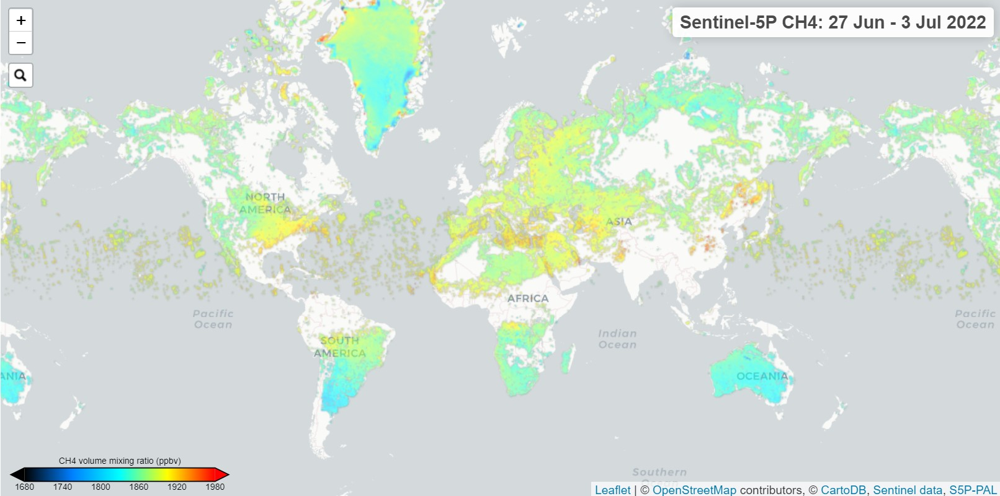

# Methane observed by Sentinel-5p TROPOMI

## Short description

Methane (CH4) is, after carbon dioxide (CO2), the most important contributor to the anthropogenically enhanced greenhouse effect. Roughly three-quarters of methane emissions are anthropogenic and as such it is important to continue the record of satellite based measurements. TROPOMI aims at providing CH4 column concentrations with high sensitivity to the Earth’s surface, good spatiotemporal coverage, and sufficient accuracy to facilitate inverse modeling of sources and sinks. TROPOMI uses absorption information from the Oxygen-A Band (760nm) and the SWIR spectral range to monitor CH4 abundances in the Earth’s atmosphere. Data from the GOSAT satellite instrument and ground-based TCCON instruments are used for verification and validation. With the most recent algortihm update, methane which was previously a land-only data product, now includes pixels with sun glint over parts of the ocean. Methane data is available in the OFFL data stream. Here below is an image of the monthly average methane from January 2022 including the ocean glint retrieval.

This TROPOMI CH4 product is available as a Collection on the Euro Data Cube:

Layer ID:
ID: AWS_CH4_WEEKLY
collectionID: 0ecb4a55-5ce2-4525-bdcb-a333d37d46ef
from 20211115 to 20220613

## Band information

The product contains one single band named "ch4".

## More information

- [Data Source](https://sentinels.copernicus.eu/web/sentinel/data-products/-/asset_publisher/fp37fc19FN8F/content/tropomi-level-2-methane)
- [Data Documentation]( http://www.tropomi.eu)
- [S5p-PAL](https://maps.s5p-pal.com/)

 
*Sentinel-5P/TROPOMI Methane concentration measurements over Europe*
