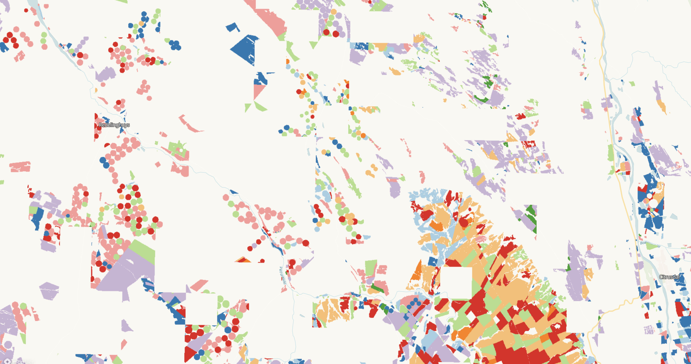

# South Africa Crop Type Competition

## Short description

The South Africa Crop Type Competition is a dataset produced as part of the [Radiant Earth Spot the Crop Challenge](https://zindi.africa/hackathons/radiant-earth-spot-the-crop-hackathon). This collection contains the field identification label which represents the area of crop fields and the corresponding crop type label collected via aerial and vehicle surveys.

## Band information

The South Africa Crop Type Competition collection contains a field identification label representing the field area and a crop type label indicating the crop type.

<table>
  <thead>
    <tr>
      <th>Band Name</th>
      <th>Sample Type</th>
      <th>Description</th>
    </tr>
  </thead>
  <tbody>
    <tr>
      <td>field_id</td>
      <td >FLOAT 32</td>
      <td>Field identification</td>
    </tr>
    <tr>
      <td>crop</td>
      <td >FLOAT 32</td>
      <td>Crop type</td>
    </tr>        
   </tbody>
</table>

### Crop type colouring scheme

<table>
  <thead>
    <tr>
      <th>Value</th>
      <th>Color</th>
      <th>Color Code</th>
      <th>Label</th>
    </tr>
  </thead>
  <tbody>
    <tr>
      <td>1</td>
      <td bgcolor="#a6cee3"></td>
      <td>#a6cee3</td>
      <td>Lucerne/Medics</td>
    </tr>
    <tr>
      <td>2</td>
      <td bgcolor="#1f78b4"></td>
      <td>#1f78b4</td>
      <td>Planted pastures (perennial)</td>
    </tr>
    <tr>
      <td>3</td>
      <td bgcolor="#b2df8a"></td>
      <td>#b2df8a</td>
      <td>Fallow</td>
    </tr>
    <tr>
      <td>4</td>
      <td bgcolor="#33a02c"></td>
      <td>#33a02c</td>
      <td>Wine grapes</td>
    </tr>
    <tr>
      <td>5</td>
      <td bgcolor="#fb9a99"></td>
      <td>#fb9a99</td>
      <td>Weeds</td>
    </tr>
    <tr>
      <td>6</td>
      <td bgcolor="#e31a1c"></td>
      <td>#e31a1c</td>
      <td> Small grain grazing</td>
    </tr>
    <tr>
      <td>7</td>
      <td bgcolor="#fdbf6f"></td>
      <td>#fdbf6f</td>
      <td>Wheat</td>
    </tr>
    <tr>
      <td>8</td>
      <td bgcolor="#ff7f00"></td>
      <td>#ff7f00</td>
      <td>Canola</td>
    </tr>
    <tr>
      <td>9</td>
      <td bgcolor="#cab2d6"></td>
      <td>#cab2d6</td>
      <td>Rooibos</td>
    </tr>
  </tbody>
</table>

## More information

More information about the South Africa Crop Type Competition collection is described on the [Source Cooperative](https://beta.source.coop/repositories/radiantearth/south-africa-crops-competition/description) (previously Radiant MLHub).

### Representative Images

*Crop types recorded in western Western Cape, South Africa in 2017.*
