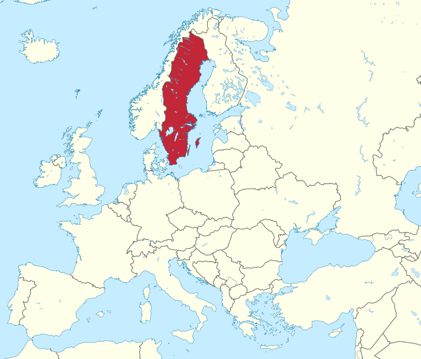

# Sweden LPIS

## Short Description  

Sweden’s Land-parcel identification system (LPIS) data is managed by [the Swedish Board of Agriculture](https://jordbruksverket.se/e-tjanster-databaser-och-appar/e-tjanster-och-databaser-stod/kartor-och-gis), and made available on the [INSPIRE Geoportal](https://inspire-geoportal.ec.europa.eu/download_details.html?view=downloadDetails&resourceId=%2FINSPIRE-adae82ae-5364-11e8-bd03-52540023a883_20200615-091102%2Fservices%2F1%2FPullResults%2F351-400%2Fdatasets%2F25&expandedSection=metadata). 
The Swedish agricultural blocks are a data set containing information on maximum eligible agricultural land according to EU definitions. The agricultural blocks are used by the Swedish Board of Agriculture to administer support to farmers, for example to check the area information in the farmers' applications and to inform the farmers about the current information. The data set does not include all agricultural land in Sweden, but only the parts that a farmer has sought support for at some time.  

A block is a polygon / surface that defines an area of agricultural land. A block is bounded by fixed boundaries. Examples of fixed boundaries are roads, stone walls, forests and buildings. A block can also be delimited by regional boundaries (Assembly boundaries of 2000). With a few exceptions, a block must be at least 0.1 hectare. On one block, only one farmer can have agricultural land (except for grazing land that is co-owned).   

The data set of agricultural blocks contains about 1,143,000 blocks. Of these, about 891,000 are field blocks and about 252,000 are pasture blocks. The total area is 3.2 million hectares, of which 2.7 million hectares are arable land and 510,000 hectares are pasture land. The average area for arable land blocks is 3.03 ha and for the pasture blocks the corresponding figure is 2.03 ha.

Originally (1997), the Land Survey's land cover was used to obtain the agricultural blocks. Since then, the orthophotos produced by [Lantmäteriet](https://www.lantmateriet.se/) have been used to update the boundaries, as well as field visits.


## Coordinate Reference System
EPSG: 3006 (SWEREF99 TM), [more info](https://epsg.io/3006)  
Use the GDAL command below to convert the LPIS collection's CRS into CRS of your choice:

```
ogr2ogr [-s_srs srs_def] [-t_srs srs_def] [dstfile] [srcfile]
```
- `s_srs <srs_def>`: set source spatial reference
- `t_srs <srs_def>`: set target spatial reference
- `<dstfile>`: file with destination projection definition
- `<srcfile>`: file with source projection definition

Example of converting  from EPSG:3006 to EPSG:3857 
```
ogr2ogr -s_srs EPSG:3006 -t_srs EPSG:3857 lpis_3857.shp lpis_3006.shp
```

## Attribute Information  

### Table 1: Description of Attributes
<table>
  <thead>
    <tr>
      <th>Name</th>
      <th>Type </th>
      <th>Description</th>
    </tr>
  </thead>
  <tbody>
    <tr>
      <td>blockid</td>
      <td >Integer</td>
      <td>Object identifier.</td>
    </tr>
    <tr>
      <td>region</td>
      <td >String </td>
      <td> Region code.</td>
    </tr>
    <tr>
      <td>areal</td>
      <td >Double </td>
      <td>Field area in sqkm.</td>
    </tr>
    <tr>
      <td>kategori</td>
      <td >String </td>
      <td >Land use category. </td>
    </tr>
    <tr>
      <td>agoslag</td>
      <td >String </td>
      <td>Land use class. </td>
  </tbody>
</table>  


### Table 2: Description of land use classes (agoslag)
<table>
  <thead>
    <tr>
      <th>Agoslag</th>
      <th>Description </th>
    </tr>
  </thead>
  <tbody>
    <tr>
      <td>Åker</td>
      <td >Farmland</td>
    </tr>
    <tr>
      <td>Bete</td>
      <td >Pastures </td>
    </tr>
    <tr>
      <td>Åkermark – långliggande vall</td>
      <td >Cropland – long-lying grassland</td>
    </tr>
    <tr>
      <td>Åkermark – permanenta grödor</td>
      <td >Cropland – permanent crops</td>
    </tr>
    <tr>
      <td>Övrig mark</td>
      <td >Other land </td>
    </tr>
    <tr>
      <td>Våtmark</td>
      <td >Wetland </td>
    </tr>
    <tr>
      <td>Okänt</td>
      <td >Unknown </td>
    </tr>
  </tbody>
</table>    

### Table 3: Description of land use categories (kategori)
<table>
  <thead>
    <tr>
      <th>Kategori</th>
      <th>Description </th>
    </tr>
  </thead>
  <tbody>
    <tr>
      <td>Gård/Miljö</td>
      <td >Farm / Environment</td>
    </tr>
    <tr>
      <td>Ej stödberättigande</td>
      <td >Not eligible </td>
    </tr>
    <tr>
      <td>Miljö</td>
      <td >Environment</td>
    </tr>
    <tr>
      <td>Miljöinvesteringar</td>
      <td >Environmental investments</td>
    </tr>
    <tr>
      <td>Okänt</td>
      <td >Unknown</td>
    </tr>
  </tbody>
</table>  

## More Information

### References  

- [Swedish Board of Agriculture](https://djur.jordbruksverket.se/swedishboardofagriculture.4.6621c2fb1231eb917e680002462.html).

### Online Resources    

- [Publicly available compressed ESRI Shapefiles]( https://jordbruksverket.se/e-tjanster-databaser-och-appar/e-tjanster-och-databaser-stod/kartor-och-gis) , updated annually for the previous year . There are no limitations to the use of these data.    

- [INSPIRE Geoportal](https://inspire-geoportal.ec.europa.eu/results.html?country=se&view=details&theme=none) with “jordbruksblock” as the search word.

### Geographic Location
  
SOURCE: TUBS @ Wikimedia Commons

