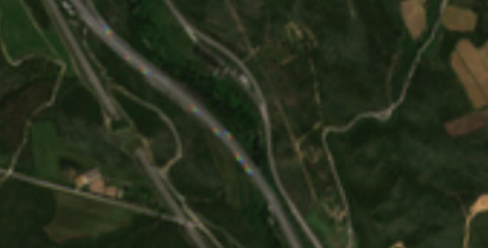
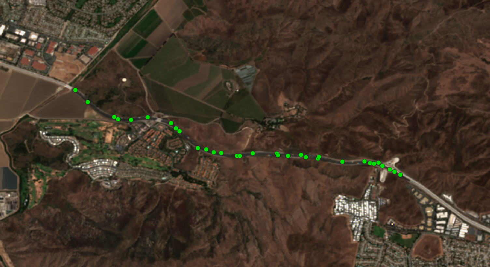

# Truck Detection

## Short Description
  The Truck Detection algorithm detects the number of moving trucks along roads using 10m resolution Sentinel-2 level 2A data.
  The author Henrik Fisser (henrik.fisser@t-online.de), developed this algorithm (with the title: Truck detection – Sensing trade from space) 
  in the context of the Euro Data Cube COVID-19 edition of Sentinel Hub’s custom script contest.
  The algorithm exploits the small offset between Sentinel-2 bands which causes moving objects to appear as rainbows in RGB images allowing the detection and mapping of moving trucks.  
  The output of the algorithm is **point vector data ( GeoPackage (.gpkg) format)** with the coordinates of the detected trucks, **dates** of detected trucks and the **valid road area** as attributes.  

## How to generate trucks vector data
Generate trucks data for your area of interest in these simple steps:  
1. Create EDC account [here](https://eurodatacube.com/register) and purchase enough [credits](https://eurodatacube.com/support?faq=purchase_credits)
1. Navigate to [EDC Browser](https://browser.eurodatacube.com/?zoom=10&lat=41.9&lng=12.5&fromTime=1970-01-01T00%3A00%3A00.000Z&toTime=2021-10-22T14%3A36%3A31.329Z&algorithm=truck-detection) 
2. Select the required input parameters 
3. Follow the check-out wizard to complete your order.  

## Data Source 

Truck detection algorithm detects trucks on Sentinel -2 L2A images. Find out more information about  Sentinel-2  data in the [documentation](https://docs.sentinel-hub.com/api/latest/data/sentinel-2-l2a/)
### Table 1: Data source description
|         |      |
| ------ | ------ |
| Data Source | Sentinel 2 L2A |
| Resolution | 10m |
| Geographical coverage | Global |
| Update Frequency | New Sentinel data are added regularly, usually within few hours after they are available on Copernicus Hub|
| Bands used | Blue, Green, Red, SCL|  

### Table 2: Description of Sentinel 2 L2A bands used
<table>
  <thead>
    <tr>
      <th>Name</th>
      <th>Description</th>
      <th>Units & Typical Range</th>
    </tr>
  </thead>
  <tbody>
    <tr>
      <td>B02</td>
      <td>Blue</td>
      <td>DN, typically from 0-10000</td>
    </tr>
    <tr>
      <td>B03</td>
      <td>Green</td>
      <td>DN, typically from 0-10000</td>
    </tr>
    <tr>
      <td>B04</td>
      <td>Red</td>
      <td>DN, typically from 0-10000</td>
    </tr>
    <tr>
      <td>SCL</td>
      <td>Scene classification data, based on Sen2Cor processor</td>
      <td>Codelist, from 0-11 </td>
    </tr>
   </tbody>
</table>  

## Detection Method
The **detection method** exploits small sensing offset of different wavelength that moving objects have in Sentinel-2 data which causes a specific reflectance relationship in the RGB, which looks like a rainbow. The method only targets the blue part of the ‘rainbow’ truck object since the dominance of blue reflectance is rare over land surfaces. This blue part of the truck serves as a marker. The detection is then achieved through reflectance band math calculations.  
**Initial step** - Create a road mask, Check that the following conditions are fulfilled:

- 0.06 < B02 < 0.2 - avoid building shadows
- B03 > 0.04 - avoid building shadows
- B04 > 0.04 - avoid building shadows
- B04 < 0.15 - avoid industry, greenhouses and other surfaces of very high reflectance
- B03 < 0.15 - avoid industry, greenhouses and other surfaces of very high reflectance
- B02 < 0.4 - be less strict with blue as we target it
- NDVI < 0.5 - avoid vegetation but keep in mind mixed pixels
- NDWI < 0.0001 - avoid water
- NDSI < 0.0001 - avoid snow

**Cloud masking** :
- If B02 > 0.25 or B03 > 0.25 or B04 > 0.25 -> cloudy pixel
- If (B02-B03)/(B02+B03) > 0.2 -> cloudy pixel
- If (B02-B04)/(B02+B04) > 0.2 -> cloudy pixel
- If (SLC == 8) or (SCL == 9) or (SCL == 10) or (SCL == 0) -> cloudy pixel

**Final step** - the ratios between B02 (blue) and B03 (green) and B02 and B04 (red) are calculated. The following thresholds are applied:  
- 0.03 < B02-B03-ratio < 0.17
- 0.05 < B02-B04-ratio < 0.2

**Result**- Each truck is represented by pixels with value 1. Connected pixels are filtered to identify single trucks and then  vectorized to get the final result. 
 
## Algorithm Input Parameters   

### Table 3: Required parameters
<table>
  <thead>
    <tr>
      <th>Name</th>
      <th>Possible Values</th>
      <th>Description</th>
    </tr>
  </thead>
  <tbody>
    <tr>
      <td>Area of Interest</td>
      <td>BBox or polygon </td>
      <td>Area of Interest</td>
    </tr>
    <tr>
      <td>Time range</td>
      <td>from 2016-11-01 to date</td>
      <td>Time period for which the algorithm will run</td>
    </tr>
    <tr>
      <td>OSM Values</td>
      <td>"motorway", "trunk", "primary"</td>
      <td>Road types found in OSM. Trucks are only detected on roads obtained from OSM. Their descriptions can be found <a href="https://wiki.openstreetmap.org/wiki/Key:highway">here</a></td>
    </tr>
    <tr>
      <td>Max. cloud coverage</td>
      <td>Integer (from 0 to 100)</td>
      <td>Maximal cloud coverage in percentage</td>
    </tr>
    <tr>
      <td>Week days</td>
      <td>"Monday", "Tuesday" ...</td>
      <td>Days of the week for which the algorithm will run in the selected time range</td>
    </tr>
   </tbody>
</table>  

### Paramters usage
<table>
  <thead>
    <tr>
      <th>Name</th>
      <th>Usage</th>
    </tr>
  </thead>
  <tbody>
    <tr>
      <td>Area of Interest</td>
      <td>The area where the algorithm requests the Sentinel-2 data and detects trucks. Note that the algorithm requests <b>ALL</b> Sentienl-2 data available within the area of interest whether there are roads or not.</td>
    </tr>
    <tr>
      <td>Time range</td>
      <td>The time range that the algorithm requests the Sentinel-2 data and detects trucks. Note that the algorithm requests <b>ALL</b> available data/acquisitions within the time range.</td>
    </tr>
    <tr>
      <td>OSM Values</td>
      <td>The road types that the algorithm detects trucks. Currently motorway, trunk, and primary are supported. The OSM Values determine the valid road area, while the area outside of selected roads are masked.</td>
    </tr>
    <tr>
      <td>Max. cloud coverage</td>
      <td>The algorithm computes the cloud coverage of the pixels located over the network of roads (pixel intersecting roads) and computes the % of cloudiness by dividing the number of cloudy pixels by the total number of pixels intersecting roads. There is a trade-off between a high value that can generate a lot of false positives due to the close similarity between cloud edges and trucks signals and a low value that can lead to undetected trucks due to over filtering.</td>
    </tr>
    <tr>
      <td>Week days</td>
      <td>The algorithm allows users to select specific week days for filtering purposes. Note that the revisit time of Sentinel-2 is 5 days, meaning that there may be only ONE acquisition for each week day in a month. To avoid an empty result, if less week days are selected, a longer time range is required.</td>
    </tr>
   </tbody>
</table>  

## Algorithm output
The output of the algorithm is point vector data in **GeoPackage format** with coordinates of the detected trucks, the dates of detected trucks and the valid road area as attributes.

### Projection of the output data
-  EPSG:4326 (WGS84 - World Geodetic System 1984)

### Format of the output data
 - GeoPackage (.gpkg)
 
### Supported delivery methods
 - AWS S3 bucket  
 - EOxHub Managed Object Storage
 - Store in EDC GeoDB
 - One-time Download 

## Pricing

- Unit price per area of interest per month (progressive volume discount based on the ordered volume during last 12 months)
    - 1.000 km2 to 1.000.000 km2 – 0.95 EUR per 1.000 km2
    - 1.000.000 km2 to 10.000.000 km2 – 0.75 EUR per 1.000 km2
    - more than 10.000.000 km2 – 0.60 EUR per 1.000 km2

- Terms of service
    - Minimum individual processing order: 1.000 km²
    - Minimum batch processing size: 100.000 km²
    - Minimum individual API request size is 1.000 km²
    - Consumption of the quota 12 months after purchase.

## More Information
### Resources
 - The original code is available in [github repository](https://github.com/hfisser/Truck_Detection_Sentinel2_COVID19)
 - EDC Checking-out "data on demand" [documentation](https://eurodatacube.com/documentation/checking_out_data_on_demand)  
 - Download [sample trucks vector data](sample.gpkg)   

### Application Areas
 - Monitor truck traffic
 - Track disruptions of logistic flow
 - Complement highway usage data

### Known Limitations
 - Possible false positives particularly in urban areas
 - Assumes moving vehicles  

### Examples  

 

*example of trucks visible on sentinel 2 image*

 
 

 

*Example of trucks detected (green dots) by the algorithm along Ventura freeway, southern California on 22-07-2020 with Sentinel 2 image overlay* 
