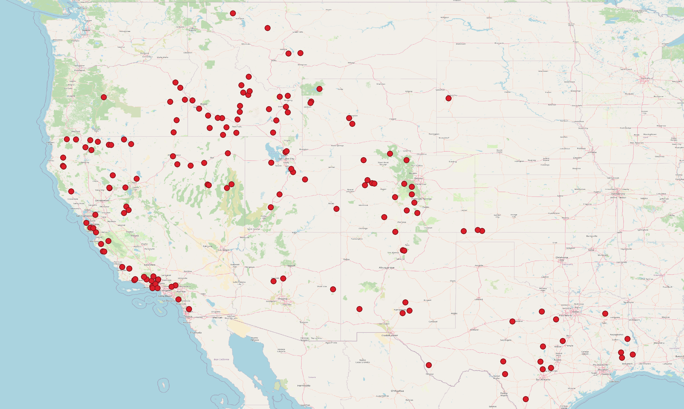

# Western USA Live Fuel Moisture

## Short description

The Western USA Live Fuel Moisture is a dataset manually collected in the western United States by the United States Forest Service. Live fuel moisture represents the mass of water in live vegetation elements like leaves, needles, and twigs divided by its oven-dried mass in percentage. It is an indicator which can be used for wildfire assessment. This collection has been rasterized from the original vector data (points) at 10 m resolution to be paired with Sentinel-1 and Sentinel-2 imagery.

## Band information

The Western USA Live Fuel Moisture contains in situ live fuel moisture measurements and other information regarding the measurement site.

<table>
  <thead>
    <tr>
      <th>Band Name</th>
      <th>Sample Type</th>
      <th>Description</th>
    </tr>
  </thead>
  <tbody>
    <tr>
      <td>percent</td>
      <td >FLOAT 32</td>
      <td>Live fuel moisture content</td>
    </tr>
    <tr>
      <td>slope</td>
      <td >FLOAT 32</td>
      <td>Terrain slope</td>
    </tr>
    <tr>
      <td>elevation</td>
      <td >FLOAT 32</td>
      <td>Altitude above mean sea level</td>
    </tr>
    <tr>
      <td>canopy_height</td>
      <td >FLOAT 32</td>
      <td>Height of canopy from ground level</td>
    </tr>
    <tr>
      <td>forest_cover</td>
      <td >FLOAT 32</td>
      <td>Land cover class from GLOBCOVER dataset</td>
    </tr>
    <tr>
      <td>silt</td>
      <td >FLOAT 32</td>
      <td>Silt fractions</td>
    </tr>
    <tr>
      <td>sand</td>
      <td >FLOAT 32</td>
      <td>Sand fraction</td>
    </tr>
    <tr>
      <td>clay</td>
      <td >FLOAT 32</td>
      <td>Clay fraction</td>
    </tr>         
   </tbody>
</table>

## More information

More information about the Western USA Fuel Moisture dataset is described on the [Source Cooperative](https://beta.source.coop/repositories/stanford/sar-moisture-conent/description) (previously Radiant MLHub).

### Representative Images

*Live fuel moisture measurement sites in western USA.*
